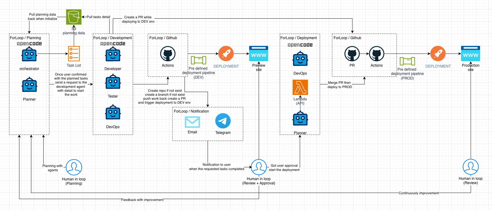

<div align="center">


[](https://opensource.org/licenses/MIT)
[](https://github.com/forloop-cc/forloop-opencode-plugin-planner/stargazers)

**AI-powered sprint planning, story management, and task automation for opencode**

[English](README.md) · [中文](README_zh.md) · [日本語](README_ja.md)

[Quick Install](#quick-install) · [How It Works](#how-it-works) · [Capabilities](#capabilities) · [FAQ](#faq)

</div>

***

## What is This?

The **ForLoop Plugin** connects [opencode](https://opencode.ai) AI agents to your [ForLoop](https://forloop.cc) workspace. Describe what you need in plain language — the agent plans, creates stories, estimates effort, and tracks progress automatically. No commands to memorize.

***

## About ForLoop

[ForLoop](https://forloop.cc) is an **AI agent platform** for autonomous development and deployment. Think of it as your team's command center — a shared space where AI agents and humans collaborate on sprints, stories, and shipping code.

**Key features:**

- **AI Agents as team members** — specialized agents plan, code, review, and deploy. They create real branches, commits, and pull requests.
- **Sprint boards** — drag-and-drop story management with real-time collaboration, AI estimation, and progress tracking.
- **Autopilot development** — agents work through your sprint board automatically, with you reviewing and approving at every checkpoint.
- **Spaces** — shared workspaces with integrated Zoom meetings, AI transcription, and a searchable cross-org knowledge base.
- **Human-in-the-loop safety** — all AI-proposed changes go through review. Nothing ships without your approval.

**This plugin** brings the collaboration features — sprint planning, story management, file uploads, and team coordination — directly into your opencode IDE.

***

## Quick Install

```bash
curl -fsSL https://raw.githubusercontent.com/forloop-cc/forloop-opencode-plugin-planner/main/install.sh | bash
```

The installer clones the plugin, installs dependencies, and configures opencode. Works on macOS, Linux, and Windows (Git Bash).

**Install options:**

```bash
curl -fsSL .../install.sh | bash              # Interactive (local by default)
curl -fsSL .../install.sh | bash -s -- -g     # Global (~/.config/opencode/)
curl -fsSL .../install.sh | bash -s -- -g -n  # Global via npm package
```
opencode downloads and caches the plugin on startup — no manual git clone or npm install needed.

**Update later:**

```bash
curl -fsSL https://raw.githubusercontent.com/forloop-cc/forloop-opencode-plugin-planner/main/update.sh | bash
```

### Prerequisites

- [opencode](https://opencode.ai) CLI installed
- A [ForLoop](https://forloop.cc) account with an API token ([create one here](https://forloop.cc/profile?tab=api-tokens))
- Token scopes: `sprint:read`, `sprint:write`, `story:read`, `story:write`, `agent:query`, `profile:read`

### Quick Start

```bash
opencode --agent forLoopPlanner
```

Or launch opencode normally and press **Tab** to switch to the **ForLoop Planner** agent from the agent picker.

The `forLoopPlanner` agent uses the plugin's built-in tools for full sprint, story, and file management. For environments without the opencode plugin installed, use `forLoopPlannerCLI` which works with the standalone `forloop` CLI binary.

### Set Your Token

**Easiest — ask the agent:**
```
"ForLoop Planner, please set my API token"
```
The agent will guide you through the setup.

**Manual setup:**
Create `~/.config/forloop/tokens.json`:
```json
{
  "default": "floop_your_token_here",
  "lastUpdated": "2026-01-01T00:00:00.000Z"
}
```
The token file is stored at `~/.config/forloop/tokens.json` with restricted permissions. Edit or replace it anytime to rotate tokens.

***

## How It Works



1. **You describe** what you need in plain language
2. **The agent** picks the right skills and tools automatically
3. **The plugin** connects to your ForLoop workspace via your API token
4. **Results** flow back — sprints planned, stories created, tasks tracked

***

## What You Can Ask Agents to Do

### Sprint Planning

| Agent can...                                      | Try saying...                                             |
| ------------------------------------------------- | --------------------------------------------------------- |
| Create and configure sprints with dates and goals | *"Set up sprint 15 starting next Monday, two weeks long"* |
| Review sprint status and progress                 | *"How is sprint 14 going? Show me all the stories"*       |
| Update sprint details mid-cycle                   | *"Extend sprint 14 by one more week"*                     |

### Story Management

| Agent can...                             | Try saying...                                                              |
| ---------------------------------------- | -------------------------------------------------------------------------- |
| Create stories from scratch or templates | *"Create a story for adding user authentication"*                          |
| Break down large stories into tasks      | *"Break down story #78 into smaller tasks"*                                |
| Update story status, priority, points    | *"Mark story #78 as done and estimate the next one at 5 points"*           |
| Create stories from templates            | *"Create a basic task for the developer agent to implement the login API"* |

### AI-Assisted Planning

| Agent can...                                  | Try saying...                                                 |
| --------------------------------------------- | ------------------------------------------------------------- |
| Get story breakdowns and implementation plans | *"Break down story #78 into subtasks"*                        |
| Estimate story point complexity               | *"Estimate the points for my login feature"*                  |
| Get sprint-level suggestions                  | *"Suggest how to organize the remaining stories this sprint"* |
| Review conversation history                   | *"Show me what we discussed about sprint 14"*                 |

### Files & Documents

| Agent can...                   | Try saying...                                             |
| ------------------------------ | --------------------------------------------------------- |
| Upload files to sprint storage | *"Upload requirements.pdf to sprint 14"*                  |
| List and manage sprint files   | *"Show me all files in sprint 14"*                        |
| Create document folders        | *"Create a docs folder for sprint 15"*                    |
| Download files                 | *"Get me the download link for the architecture diagram"* |

### Teams & Organizations

| Agent can...                 | Try saying...                                    |
| ---------------------------- | ------------------------------------------------ |
| View organization membership | *"Show me who's on the Engineering team"*        |
| Check usage quotas           | *"How many stories do we have left this month?"* |
| Manage team settings         | *"Create a new organization called Design Team"* |

***

## Plugin Capabilities

The plugin provides these tools to opencode agents. Agents use them automatically — you don't call them directly. For agent definitions and skills, see the [forloop-agents-skills](https://github.com/forloop-cc/forloop-agents-skills) repo.

**Sprint Management** — create, update, list, and delete sprints with full metadata\
**Story Operations** — full CRUD for stories with template support, priority, and points\
**AI Agent Tools** — story breakdown, point estimation, sprint suggestions, conversation history\
**File Management** — S3-backed upload, download, listing, and document folders\
**Organization Management** — teams, membership, and quota tracking\
**Scheduling** — create and manage sprint meetings with video links

***

## Agents & Skills

Agents and skills are maintained in a separate repo: **[forloop-agents-skills](https://github.com/forloop-cc/forloop-agents-skills)**. The installer (above) sets them up automatically. For manual setup:

```bash
git clone https://github.com/forloop-cc/forloop-agents-skills.git ~/.config/forloop/agents-skills
ln -sf ~/.config/forloop/agents-skills/agents/*.md ~/.config/opencode/agents/
ln -sfn ~/.config/forloop/agents-skills/skills/*/ ~/.config/opencode/skills/
```

The repo includes 2 agents and 15 skills covering sprint planning, story creation, task tracking, file management, and more. See the [repo README](https://github.com/forloop-cc/forloop-agents-skills) for the full list.

### Included Agents

| Agent                                          | Best for...                                                     |
| ---------------------------------------------- | --------------------------------------------------------------- |
| **ForLoop Planner** (`@forLoopPlanner`)        | Sprint planning, story creation, task breakdown, sprint reviews |
| **Story Evaluator** (`@forLoopStoryEvaluator`) | Point estimation, complexity analysis                           |

***

## FAQ

**How do I use this?** Start opencode, switch to the ForLoop Planner agent (TAB), and describe what you need. The agent handles everything.

**What's opencode?** A free, open-source AI coding assistant. [Install here](https://opencode.ai).

**Do I need to memorize commands?** No. The agents use the tools automatically. Just talk to them.

**Where is my token stored?** `~/.config/forloop/tokens.json` with restricted file permissions.

**Can I auto-detect my sprint?** Yes — name your git branch `sprint-XXX` or set `FORLOOP_SPRINT_ID=14`.

**How do I uninstall?** Remove the plugin entry from your `opencode.json` plugin array. For agents and skills, delete the symlinks from `~/.config/opencode/agents/` and `~/.config/opencode/skills/`.

**Does this work on Windows?** Yes — use Git Bash or WSL.

***

## Contributing

Issues and PRs welcome. See [CONTRIBUTING.md](CONTRIBUTING.md).

***

## Security

See [SECURITY.md](SECURITY.md). Never commit API tokens. Use minimum required scopes.

***

## License

MIT — see [LICENSE](LICENSE).
