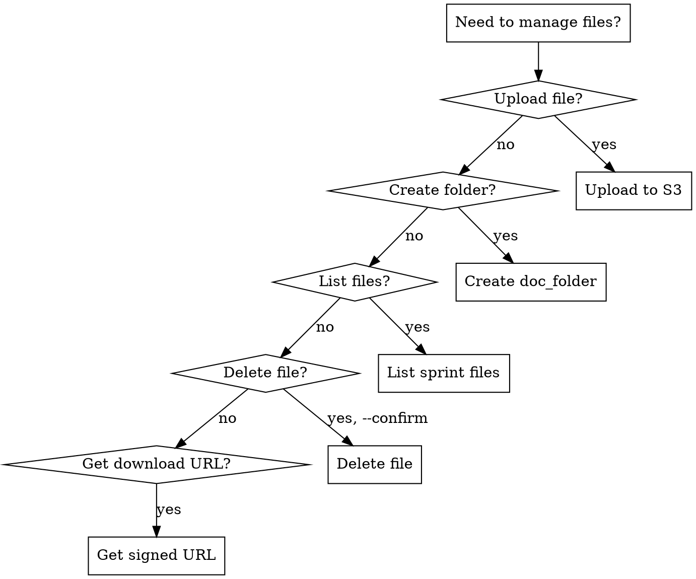

# File Management with ForLoop

## Overview
Upload, organize, and manage files in ForLoop sprints using S3 storage. This skill covers the complete file lifecycle from upload to deletion. Includes immediate upload pattern for .forloop/ folder files.

## When to Use
- Uploading documents, images, or media to sprints
- Creating document folders for organization
- Listing or managing sprint files
- Sharing file access with team members
- **NEW:** Uploading .forloop/ knowledge, plan, and task files to S3

## When NOT to Use
- Storing code (use repository integration)
- Large video files (>100MB, consider external hosting)
- Temporary files

## Process Flow



---

## File Upload Workflow

### Prerequisites

- Valid ForLoop API token
- Sprint ID for file attachment
- File must exist locally

### Aivy Sync Mode (Required for `~/.forloop/*`)

If the file you are creating/updating/removing is under `~/.forloop/*` (or project-local `./.forloop/*`), do not use `forloop.file.upload` for persistence.

Use:

```
forloop.sync.localToS3(filePath=.forloop/{knowledge|plan|task}/..., sprintId={sprintId})
```

For deletions:

```
forloop.sync.localToS3(filePath=.forloop/{knowledge|plan|task}/..., sprintId={sprintId}, action=delete)
```

### Upload File

**Tool:** `forloop.file.upload`

**Arguments:**
- `--filePath` (required): Local path to file
- `--sprintId` (required): Target sprint
- `--description` (optional): File description

**Example:**
```
forloop.file.upload(
  filePath=./requirements.pdf,
  sprintId=14,
  description="Project requirements document"
)
```

**Expected Output:**
```
✅ File uploaded successfully!

**File**: requirements.pdf
**Size**: 1.5 MB
**URL**: https://s3.amazonaws.com/...
**Description**: Project requirements document
```

**BEFORE claiming complete:**
1. Run: `forloop.file.list --sprintId {id}`
2. Verify: Uploaded file appears in list
3. ONLY THEN: Claim "File uploaded successfully"

## Red Flags - STOP

**If you catch yourself:**
- Expressing satisfaction before verification ("Great!", "File uploaded!")
- About to claim upload succeeded without running `forloop.file.list`
- "Upload command returned success, that's enough"
- "File list looks good" (glancing, not reading)

**ALL of these mean: STOP. Run verification first.**

### Supported File Types

**Images:** .png, .jpg, .jpeg, .gif
**Documents:** .pdf, .txt, .md, .json, .csv
**Media:** .mp4 (video), .mp3 (audio)
**Other:** Any file type (default: application/octet-stream)

### File Size Limits

Depends on user tier:
- **Free:** Up to 10 MB per file
- **Team:** Up to 50 MB per file
- **Enterprise:** Up to 100 MB per file

---

## Document Folder Workflow

### Create Document Folder

**Tool:** `forloop.doc.folder`

**Purpose:** Create a container for organizing related files

**Arguments:**
- `--sprintId` (required): Target sprint
- `--title` (required): Folder name
- `--description` (optional): Folder description
- `--permissions` (optional): public, team, or private

**Example:**
```
forloop.doc.folder(
  sprintId=14,
  title="Meeting Recordings",
  description="Video recordings of team meetings",
  permissions=team
)
```

**Expected Output:**
```
✅ Document folder created!

**#81**: Meeting Recordings
**Sprint**: #14
**Type**: doc_folder
**Permissions**: team

📁 **Next Steps:**
  1. Upload files with: forloop.file.upload --sprintId 14
  2. List files with: forloop.file.list --sprintId 14
```

### Upload Files to Folder

Files are automatically associated with the folder story:

```
forloop.file.upload(
  filePath=./meeting_2026_03_28.mp4,
  sprintId=14,
  description="Sprint planning meeting"
)
```

---

## File Listing Workflow

### List Sprint Files

**Tool:** `forloop.file.list`

**Arguments:**
- `--sprintId` (required)

**Example:**
```
forloop.file.list(sprintId=14)
```

**Expected Output:**
```
🗂️ Files in Sprint #14:

📎 **requirements.pdf**
   Size: 1.5 MB | Type: application/pdf
   Uploaded: 3/28/2026 by John Doe
   URL: https://s3.amazonaws.com/...

📎 **architecture.png**
   Size: 250 KB | Type: image/png
   Uploaded: 3/27/2026 by Jane Smith
   URL: https://s3.amazonaws.com/...

📎 **meeting_notes.md**
   Size: 5 KB | Type: text/markdown
   Uploaded: 3/26/2026 by Bob Johnson
   URL: https://s3.amazonaws.com/...
```

---

## File Deletion Workflow

### Delete File

**Tool:** `forloop.file.delete`

**⚠️ Warning:** This action is permanent!

**Arguments:**
- `--fileId` (required)
- `--confirm` (required, boolean)

**Example:**
```
# Warning shows first
forloop.file.delete(fileId=123)

# Then confirm
forloop.file.delete(fileId=123, confirm=true)
```

**Expected Output:**
```
✅ File #123 deleted successfully.
```

---

## ForLoop Folder Upload Workflow (NEW)

### Upload ~/.forloop/ Files

**Purpose:** Synchronize planning artifacts to S3 for team access

**Supported file types:**
- `~/.forloop/knowledge/knowledge-{topic}-{datetime}.md`
- `~/.forloop/plan/plan-{sprintId}-{datetime}.md`
- `~/.forloop/task/task-{sprintId}-{datetime}.md`

### Upload with S3 Folder Organization

**Organize files in S3 subfolders:**

```
# Upload plan to project folder
forloop.file.upload(
  filePath=~/.forloop/plan/plan-14-20260410-093015.md,
  sprintId=14,
  folder=project/plans,
  description="Sprint 14 plan document"
)

# Upload knowledge to project/knowledge folder
forloop.file.upload(
  filePath=~/.forloop/knowledge/knowledge-auth-20260410-093015.md,
  sprintId=14,
  folder=project/knowledge,
  description="Auth system knowledge"
)

# Upload task file to project/tasks folder
forloop.file.upload(
  filePath=~/.forloop/task/task-14-20260410-100000.md,
  sprintId=14,
  folder=project/tasks,
  description="Sprint 14 task list"
)
```

**Result - S3 Structure:**
```
s3://bucket/sprint/14/
├── project/
│   ├── plans/
│   │   └── plan-14-20260410-093015.md
│   ├── knowledge/
│   │   └── knowledge-auth-20260410-093015.md
│   └── tasks/
│       └── task-14-20260410-100000.md
```

### Upload with doc_folder Linking

**Link files to doc_folder stories for UI organization:**

```
# Step 1: Create a doc_folder story
forloop.doc.folder(
  sprintId=14,
  title="Project Artifacts",
  description="Planning documents and knowledge",
  permissions=team
)

# Step 2: Upload files and link to doc_folder (Story #101)
forloop.file.upload(
  filePath=~/.forloop/plan/plan-14.md,
  sprintId=14,
  folder=project,
  storyId=101,
  description="Sprint plan linked to Project Artifacts folder"
)
```

**Result:**
- **S3 Path:** `s3://bucket/sprint/14/project/plan-14.md` (physical organization)
- **Database:** `{ storyId: 101 }` (logical grouping in UI)

### Knowledge File Upload

```
forloop.file.upload(
  filePath=~/.forloop/knowledge/knowledge-{topic}-{datetime}.md,
  sprintId=14,
  description="Knowledge: {topic}"
)
```

### Plan File Upload

```
forloop.file.upload(
  filePath=~/.forloop/plan/plan-{sprintId}-{datetime}.md,
  sprintId=14,
  description="Sprint {sprintId} plan document"
)
```

### Task File Upload

```
forloop.file.upload(
  filePath=~/.forloop/task/task-{sprintId}-{datetime}.md,
  sprintId=14,
  description="Sprint {sprintId} task list with {count} stories"
)
```

### Deduplication Check

Before uploading, check if file already exists:

```
# List existing S3 files
forloop.file.list(sprintId=14)

# Compare filenames to avoid duplicates
```

### Bulk Upload Pattern

For multiple files:

```
# Upload all ~/.forloop files for sprint
forloop.file.upload(filePath=~/.forloop/knowledge/knowledge-*.md, sprintId=14)
forloop.file.upload(filePath=~/.forloop/plan/plan-*.md, sprintId=14)
forloop.file.upload(filePath=~/.forloop/task/task-*.md, sprintId=14)
```

### Upload Timing

**Immediate upload pattern (recommended):**
- Upload immediately after file creation
- Ensures no data loss
- Files available to team immediately

**Batch upload (alternative):**
- Queue files during session
- Upload all at end of session
- Risk: Data loss if session interrupted

---

## File Deletion Workflow

### Get Download URL

**Tool:** `forloop.file.download`

**Arguments:**
- `--fileId` (required)

**Example:**
```
forloop.file.download(fileId=456)
```

**Expected Output:**
```
📥 Download URL

**File ID**: 456
**URL**: https://s3.amazonaws.com/...

⚠️ This URL may expire. Download the file soon.
```

---

## Common Scenarios

### Scenario 1: Document Project Requirements

**Goal:** Store requirements document in sprint

**Steps:**
```
# Upload requirements
forloop.file.upload(
  filePath=./docs/requirements.pdf,
  sprintId=14,
  description="Project requirements v1.0"
)

# List to verify
forloop.file.list(sprintId=14)
```

### Scenario 2: Organize Meeting Recordings

**Goal:** Create folder and upload meeting video

**Steps:**
```
# Create folder
forloop.doc.folder(
  sprintId=14,
  title="Sprint 14 Meetings",
  description="Meeting recordings for sprint 14"
)

# Upload video
forloop.file.upload(
  filePath=./recordings/sprint14_planning.mp4,
  sprintId=14,
  description="Sprint planning session"
)
```

### Scenario 3: Share Architecture Diagram

**Goal:** Upload and share architecture image with team

**Steps:**
```
# Upload with team permissions
forloop.file.upload(
  filePath=./diagrams/architecture.png,
  sprintId=14,
  description="System architecture diagram"
)

# Get download URL for sharing
forloop.file.download(fileId=789)
```

### Scenario 4: Clean Up Old Files

**Goal:** Remove outdated files from sprint

**Steps:**
```
# List files first
forloop.file.list(sprintId=14)

# Delete unwanted files
forloop.file.delete(fileId=100, confirm=true)
forloop.file.delete(fileId=101, confirm=true)
```

---

## S3 Storage Details

### File Storage Location

Files are stored in S3 with the following key structure:
```
sprints/{sprintId}/stories/{storyId}/{filename}
```

### File Metadata

Stored in ForLoop database:
- File name (original and stored)
- File type (MIME type)
- File size (bytes)
- Upload timestamp
- Uploader ID
- Canvas position (x, y, zIndex)
- Associated story ID

### Access Control

- **public**: Anyone with link can access
- **team**: Team members only
- **private**: Owner only

---

## Tool Reference

### forloop.file.upload

**Purpose:** Upload file to S3 via presigned URL

**Arguments:**
- `--filePath` (required): Local file path
- `--sprintId` (required): Sprint ID
- `--description` (optional)

**Process:**
1. Get presigned upload URL
2. Upload directly to S3
3. Complete upload in database
4. Return file details

---

### forloop.file.list

**Purpose:** List files in a sprint

**Arguments:**
- `--sprintId` (required)

**Returns:** File list with metadata

---

### forloop.file.delete

**Purpose:** Permanently delete file

**Arguments:**
- `--fileId` (required)
- `--confirm` (required, boolean)

**Process:**
1. Delete from database
2. Delete from S3
3. Release storage quota

---

### forloop.file.download

**Purpose:** Get signed download URL

**Arguments:**
- `--fileId` (required)

**Returns:** Time-limited download URL

---

### forloop.doc.folder

**Purpose:** Create document folder

**Arguments:**
- `--sprintId` (required)
- `--title` (required)
- `--description` (optional)
- `--permissions` (optional)

**Creates:** Story with type `doc_folder`

---

## Compliance

**All file uploads must be verified with `forloop.file.list` before claiming success.** Files under ~/.forloop/* must use S3 sync, not direct upload.

## Anti-Patterns

| # | ❌ Don't | ✅ Do Instead |
|---|---------|--------------|
| 1 | Claim upload succeeded without verification | Run `forloop.file.list` to confirm file appears |
| 2 | Use `forloop.file.upload` for ~/.forloop/* files | Use `forloop.sync.localToS3` for .forloop/ files |
| 3 | Skip deduplication check | List existing files before uploading |
| 4 | Upload files > tier limit | Check quota with `forloop.user.quotas` first |
| 5 | Delete without `--confirm true` | Explicit confirmation required |
| 6 | Upload to wrong S3 folder | Use `--folder project/{plans,knowledge,tasks}` |
| 7 | Skip doc_folder linking for .forloop/ files | Link to doc_folder story for organization |

## Quality Gates

## Verification Checklist

Before file operations:
- [ ] File exists locally (for upload)
- [ ] Sprint ID is valid
- [ ] User has write permission for sprint
- [ ] File size within quota
- [ ] For deletions: confirm intention

## Rationalization Prevention

| Excuse | Reality |
|--------|---------|
| "Upload succeeded, don't need to verify" | RUN forloop.file.list to confirm |
| "File list looks good" | READ full output, don't glance |
| "Skip deduplication check, it's fine" | Duplicates waste storage and confuse team |
| "Just this one file, don't need full process" | Simple uploads need verification too |
| "We're in a hurry, skip S3 sync" | Unspped files = team can't access |
| "I'll verify at the end of session" | End of session never comes |

---

## Integration with Other Skills

This skill works with:
- **knowledge-management** - Upload knowledge files to S3
- **plan-documentation** - Upload plan files to S3
- **task-tracking** - Upload task files to S3
- **forloop-context** - Sync verification on session start
- **template-based-tasks** - Attach documents to tasks
- **sprint-planning** - Upload sprint artifacts
- **user-management** - Check storage quotas

---

**Version:** 1.0.0  
**Last Updated:** 2026-03-28
