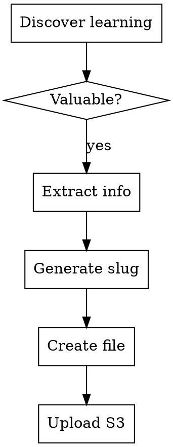

# Knowledge Management with ForLoop

## Overview

Automatically captures project learnings, insights, and discoveries during agent work. Creates a persistent knowledge base that grows with the project and syncs to S3 for team access.

**Important:** Before creating new knowledge files, check `knowledge-application.md` (synced from S3 via `forloopSyncS3ToLocal`). This file is maintained by the `forLoopTaskSupervisor` and contains the current application state (architecture, features, codebase, infrastructure, recent changes). Do not duplicate information already captured there.

## When to Use

### Automatic Triggers

The skill activates automatically when:

| Trigger | Example |
|---------|---------|
| User explains domain | "Our users have tiers: free, pro, enterprise" |
| Technical decisions | "We're using Redis for session caching" |
| Architecture insights | "Auth uses JWT with 1-hour expiry" |
| Requirements gathered | "System needs OAuth login support" |
| Code analysis findings | "Middleware pattern discovered in src/" |
| Problem solving | "Root cause: race condition in checkout" |

### Keyword Triggers

User phrases that activate this skill:
- "Let me explain how this works..."
- "The system needs to..."
- "Important: remember that..."
- "The business rule is..."
- "We decided to use X because..."
- "Key constraint: ..."
- "Learn this: ..."
- "Remember: ..."

## When NOT to Use

- Trivial one-line facts
- Temporary session-only context
- Information already documented
- Sensitive data (passwords, keys, secrets)

## Process Flow



## Workflow Steps

### Step 1: Identify Valuable Information

**Criteria for capture:**
- ✅ Domain knowledge (business rules, user types, workflows)
- ✅ Technical architecture (system design, components)
- ✅ Decisions made (why X over Y)
- ✅ Constraints (technical, business, timeline)
- ✅ API/Service details (endpoints, auth, rate limits)
- ✅ Database schema (tables, relationships)
- ✅ Integration points (external services, webhooks)

### Step 2: Extract Key Information

Structure as:
```markdown
## Context
What situation led to this learning?

## Discovery
What was learned?

## Implications
How does this affect the project?

## References
Related files, stories, or links
```

### Step 3: Generate Topic Slug

Create short, descriptive filename:

```
Input: "The authentication uses JWT tokens with 1-hour expiry"
Topic: auth-jwt-tokens
Filename: knowledge-auth-jwt-tokens-20260410-093015.md

Input: "Users can have roles: admin, moderator, viewer"
Topic: user-roles
Filename: knowledge-user-roles-20260410-093530.md
```

### Step 4: Create Knowledge File

**Location:** `.forloop/sprint-{sprintId}/knowledge/knowledge-{topic}-{datetime}.md`

**Datetime format:** `YYYYMMDD-HHMMSS`

**Template:**
```markdown
# Knowledge: {Topic}

## Metadata
- **Created:** {datetime}
- **Source:** {user-input|code-analysis|research|decision}
- **Category:** {domain|technical|architecture|process}
- **Related Sprint:** #{sprintId}

## Summary
{2-3 sentence summary}

## Details

### Context
{Background information}

### What We Learned
{Detailed findings}

### Implications
{Impact on project}

### References
- Related file: `{path}`
- Related story: `#{storyId}`

---
*Captured by ForLoop Planner Agent*
```

### Step 5: Upload to S3

**Ensure doc_folder exists first:**

```
forloopSyncAivyFolder(sprintId={sprintId})
```

**Get the doc_folder story ID:**

```
forloopAivyDocGet(sprintId={sprintId})
```

The tool returns the story ID (e.g., `#123 forloop Aivy doc`).

**Upload with doc_folder linking:**

```
forloopSyncLocalToS3(
  filePath=.forloop/sprint-{sprintId}/knowledge/knowledge-{topic}-{datetime}.md,
  sprintId={sprintId},
  folder=project/knowledge,
  storyId=123
)
```

**BEFORE claiming complete:**
1. Run: `forloopFileList(sprintId={sprintId})`
2. Verify: Knowledge file appears in list under `project/knowledge/` folder
3. ONLY THEN: Claim "Knowledge captured successfully"

## Red Flags - STOP

**If you catch yourself:**
- Expressing satisfaction before verification ("Great!", "Knowledge captured!")
- About to claim knowledge uploaded without running `forloopFileList`
- Thinking "it's just local knowledge, don't need S3"
- "I'll upload later with the batch"
- Knowledge file uploaded to wrong S3 path (should be project/knowledge/)
- Skipping doc_folder linking

**ALL of these mean: STOP. Run verification first.**

## Knowledge Categories

| Category | Description | Examples |
|----------|-------------|----------|
| **domain** | Business logic, user types | User tiers, order workflow |
| **technical** | Implementation details | Auth middleware, validation |
| **architecture** | System design | Redis cache, microservices |
| **process** | Team practices | Deployment, testing workflow |

## Examples

### Example 1: User Explains Domain

**User:** "Our users have different tiers. Free tier gets 100 API calls/day, Pro gets 10000, Enterprise is unlimited."

**Agent creates:**
```markdown
# Knowledge: User API Tiers

## Metadata
- **Created:** 2026-04-10T09:30:15Z
- **Source:** user-input
- **Category:** domain

## Summary
Users are segmented into three tiers with different API rate limits.

## Details

### Context
Discussion about API rate limiting requirements.

### What We Learned
Three user tiers with specific API quotas:
- **Free:** 100 calls/day
- **Pro:** 10,000 calls/day
- **Enterprise:** Unlimited

### Implications
- Need tier field in user model
- Need quota tracking system
- Need rate limiting middleware

---
*Captured by ForLoop Planner Agent*
```

### Example 2: Technical Decision

**User:** "We're using Redis for caching session data because it's faster than database queries."

**Agent creates:**
```markdown
# Knowledge: Redis Session Cache

## Metadata
- **Created:** 2026-04-10T10:15:00Z
- **Source:** decision
- **Category:** architecture

## Summary
Redis is used for session caching to improve performance.

## Details

### Context
Architecture discussion about session management.

### What We Learned
- Redis chosen for session storage
- Reason: Faster than database queries
- Session TTL: 1 hour

### Implications
- Need Redis client in application
- Need Redis instance provisioned

---
*Captured by ForLoop Planner Agent*
```

## File Management

### Deduplication Check

Before creating a new knowledge file, check three sources to avoid duplication:

1. **`knowledge-application.md`** — If synced from S3, read it first. It contains canonical application-level information. Don't create a separate knowledge file for topics already covered here.
2. **Local knowledge files** — Check `~/.forloop/sprint-{sprintId}/knowledge/` for existing files on the same topic
3. **S3 knowledge files** — Run `forloopFileList(sprintId={sprintId})` to see all remote files

If a topic already exists:
- Append as new section, OR
- Create with version suffix: `knowledge-topic-v2-datetime.md`

### Retention

- Keep all files (cumulative knowledge)
- No automatic deletion
- Split files > 500 lines by sub-topic

## Integration with Other Skills

| Skill | Integration |
|-------|-------------|
| `sprint-planning` | Captures planning decisions |
| `plan-documentation` | References knowledge in plans |
| `task-tracking` | Links tasks to knowledge |
| `forloop-context` | Loads knowledge on session start |

## Best Practices

### Do
- ✅ Capture decisions and reasoning
- ✅ Include concrete details (numbers, names, paths)
- ✅ Link related files and stories
- ✅ Use clear, searchable topic names
- ✅ Upload to `project/knowledge/` folder
- ✅ Link to doc_folder
- ✅ Verify upload immediately

### Don't
- ❌ Capture obvious or temporary info
- ❌ Write overly long files (split instead)
- ❌ Use vague topic names
- ❌ Include sensitive information
- ❌ Upload to wrong folder
- ❌ Skip doc_folder linking

## Compliance

**All knowledge captured during sessions must be written to file and synced to S3 immediately.**

## Anti-Patterns

| # | ❌ Don't | ✅ Do Instead |
|---|---------|--------------|
| 1 | Capture without writing to ~/.forloop/sprint-{id}/knowledge/ | Create file with sprint subdir and knowledge-{topic}-{datetime}.md format |
| 2 | Skip S3 sync after creating knowledge file | Run `forloopSyncLocalToS3` immediately |
| 3 | Upload to wrong S3 folder | Use `folder=project/knowledge` |
| 4 | Skip doc_folder linking | Link to doc_folder story for organization |
| 5 | Create files > 500 lines | Split by sub-topic |
| 6 | Include sensitive data (passwords, keys) | Never capture secrets in knowledge files |

## Quality Gates

- [ ] Knowledge structured with Context/Discovery/Implications/References
- [ ] Topic slug is short and descriptive
- [ ] File created at `.forloop/sprint-{sprintId}/knowledge/knowledge-{topic}-{datetime}.md`
- [ ] Doc folder exists (`forloopSyncAivyFolder`)
- [ ] File uploaded to `project/knowledge/` S3 folder
- [ ] File linked to doc_folder story
- [ ] Upload verified via `forloopFileList`
- [ ] Deduplication checked before creating new file

## Rationalization Prevention

| Excuse | Reality |
|--------|---------|
| "This is obvious, don't need to capture" | Obvious today, forgotten tomorrow |
| "Skip upload, it's just local knowledge" | Team can't access - upload immediately |
| "I'll remember this, don't need a file" | Memory fails - write it down |
| "Just a small detail, not worth capturing" | Small details become critical later |
| "Upload later with the batch" | Later never comes - upload now |
| "The user can explain again if needed" | User's time is valuable - capture once |
| "Folder path doesn't matter" | Wrong folder = can't find files later |
| "Don't need doc_folder linking" | Linking enables proper file organization |

---

**Version:** 1.0.0  
**Created:** 2026-04-10
