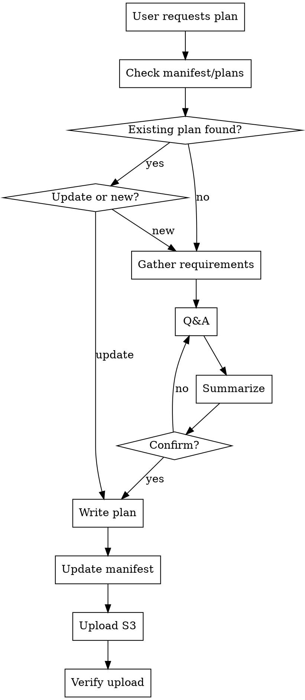

# Plan Documentation with ForLoop

## Overview

Creates and maintains sprint plan documents with proper user confirmation workflow. Plans are stored locally in `~/.forloop/sprint-{id}/plan/` and synchronized to S3 for team access.

## When to Use

### Trigger Phrases

| User Request | Action |
|--------------|--------|
| "Plan sprint X" | Create sprint plan |
| "Create a plan for..." | Create project plan |
| "What's our sprint strategy?" | Generate planning document |
| "Let's design the approach" | Create design spec |
| "Document the requirements" | Create requirements plan |

## When NOT to Use

- Mid-sprint small changes (update existing plan)
- Single story requests (use story-creation)
- Without user confirmation workflow

## Process Flow



**Key Decisions:**
1. Existing plan found? → Update vs. create new
2. User confirms requirements? → Proceed vs. gather more

## Workflow Steps

### Step 1: Check Existing Plans

Check manifest first: `~/.forloop/manifest.json`. If valid, load plan from `~/.forloop/sprint-{activeSprintId}/plan/`.

If manifest exists and valid:
- Use `activeSprintId` 
- Load referenced plan file

If no manifest, scan `~/.forloop/sprint-{sprintId}/plan/` for the most recent plan for the sprint.

Ask: "Found existing plan. Update or create new?"

### Step 2: Gather Requirements

**Ask targeted questions:**

```
📋 Sprint Planning Questions

1. Sprint Goal
   What is the primary objective?

2. Scope
   What features are IN scope?
   What is OUT of scope?

3. Timeline
   Start and end dates?

4. Constraints
   Deadlines, dependencies, limitations?

5. Team Capacity
   Team size and availability?

6. Success Criteria
   How do we measure success?
```

### Step 3: Summarize Requirements

**Present summary:**

```
📝 Requirements Summary

Sprint Goal: {goal statement}

In Scope:
- {Item 1}
- {Item 2}

Out of Scope:
- {Item 1}
- {Item 2}

Timeline: {start} to {end} ({days} days)

Constraints:
- {Constraint 1}
- {Constraint 2}

Confirm I should create the plan document?
```

### Step 4: Create Directories

```bash
mkdir -p .forloop/sprint-{sprintId}/knowledge .forloop/sprint-{sprintId}/plan .forloop/sprint-{sprintId}/task
```

### Step 5: Write Plan File

**Location:** `.forloop/sprint-{sprintId}/plan/plan-{sprintId}-{datetime}.md`

**Datetime format:** `YYYYMMDD-HHMMSS`

**Template with YAML front matter:**
```markdown
---
type: plan
sprintId: {sprintId}
created: {datetime}
updated: {datetime}
status: draft
previousPlanFile: ""
active: true
---

# Sprint Plan - Sprint #{sprintId}

## Metadata
- **Created:** {datetime}
- **Last Updated:** {datetime}
- **Author:** ForLoop Planner Agent
- **Status:** draft | approved | in-progress

## Sprint Goal
{Clear, measurable goal statement}

## Overview

| Property | Value |
|----------|-------|
| Sprint ID | #{sprintId} |
| Start Date | {date} |
| End Date | {date} |
| Duration | {days} days |
| Team Size | {count} |

## Scope

### In Scope
- {Feature 1}
- {Feature 2}

### Out of Scope
- {Excluded 1}
- {Excluded 2}

## Requirements

### Functional Requirements
1. {Requirement 1}
2. {Requirement 2}

### Non-Functional Requirements
1. {Performance requirement}
2. {Security requirement}

## Timeline

### Key Dates
| Milestone | Date | Status |
|-----------|------|--------|
| Sprint Start | {date} | ✓ |
| Sprint End | {date} | pending |

## Dependencies
- {Dependency 1}
- {Dependency 2}

## Risks
| Risk | Impact | Mitigation |
|------|--------|------------|
| {Risk 1} | high | {Strategy} |

## Open Questions
- [ ] {Question 1}
- [ ] {Question 2}

---
*Generated by ForLoop Planner Agent*
*Next: Run task-tracking to create stories*
```

### Step 6: Update Active Manifest

**Create/update `~/.forloop/manifest.json`:**

```json
{
  "version": 2,
  "activeSprintId": {sprintId},
  "sprints": {
    "{sprintId}": {
      "sprintDir": "sprint-{sprintId}",
      "plan": {
        "file": "sprint-{sprintId}/plan/plan-{sprintId}-{datetime}.md",
        "createdAt": "{datetime}"
      }
    }
  }
}
```

### Step 7: Upload to S3

**Ensure doc_folder exists first:**

```
forloop.sync.aivy.folder(sprintId={sprintId})
```

**Get the doc_folder story ID:**

```
forloop.aivy.doc.get(sprintId={sprintId})
```

The tool returns the story ID (e.g., `#123 forloop Aivy doc`).

**Upload with doc_folder linking:**

```
forloop.sync.localToS3(
  filePath=.forloop/sprint-{sprintId}/plan/plan-{sprintId}-{datetime}.md,
  sprintId={sprintId},
  folder=project/plans,
  storyId=123
)
```

**BEFORE claiming complete:**
1. Run: `forloop.file.list --sprintId {sprintId}`
2. Verify: Plan file appears in list under `project/plans/` folder
3. ONLY THEN: Claim "Plan uploaded successfully"

## Plan Update Workflow

### When User Requests Changes

1. Read existing plan
2. Identify sections to update
3. Confirm changes with user
4. Create new version (new datetime)
5. Update manifest to point to new version
6. Upload to S3

### Version Naming

```
.forloop/sprint-{id}/plan/
├── plan-14-20260410-093015.md (v1.0)
├── plan-14-20260410-143022.md (v1.1 updated)
```

## Confirmation Workflow

**Required before:**
- ✅ Creating initial plan
- ✅ Updating existing plan
- ✅ Uploading to S3

**Confirmation methods:**
- User types "confirm" or "yes"
- Explicit approval message

## Red Flags - STOP

**If you catch yourself:**
- Expressing satisfaction before verification ("Great!", "Perfect!", "Done!")
- About to claim plan uploaded without running `forloop.file.list`
- Thinking "just this once" skip confirmation
- User confirmed verbally but you haven't verified upload
- About to skip folder parameter for S3 upload
- Plan file uploaded to wrong S3 path

**ALL of these mean: STOP. Run verification first.**

## Examples

### Example 1: New Sprint Plan

**User:** "Help me plan sprint 14"

**Workflow:**
1. Check manifest → none exists
2. Ask planning questions
3. User provides answers
4. Summarize and confirm
5. Create: `.forloop/sprint-{sprintId}/plan/plan-14-20260410-093015.md`
6. Update manifest
7. Upload to S3

### Example 2: Plan Update

**User:** "Add login feature to sprint 14"

**Workflow:**
1. Read: `.forloop/sprint-{sprintId}/plan/plan-14-20260410-093015.md`
2. Confirm: "Add login to scope. Confirm?"
3. Create new version with new timestamp
4. Update manifest
5. Upload to S3

## Plan Validation Checklist

Before completing:
- [ ] Sprint goal is clear and measurable
- [ ] Scope boundaries defined (in/out)
- [ ] Timeline with specific dates
- [ ] Requirements detailed
- [ ] Dependencies identified
- [ ] Risks documented
- [ ] File uploaded to S3 under `project/plans/`
- [ ] File linked to doc_folder story
- [ ] Manifest updated

## Integration with Other Skills

| Skill | Integration |
|-------|-------------|
| `knowledge-management` | Captures planning decisions |
| `task-tracking` | Reads plan for task creation |
| `sprint-planning` | Sub-workflow of sprint-planning |
| `file-management` | S3 upload pattern |
| `forloop-context` | Loads plan on session start |

## Troubleshooting

### Issue: Cannot create plan

**Solution:**
```bash
chmod 755 .forloop/plan
```

### Issue: S3 upload fails

**Check:**
```
forloop.token.get()
forloop.sprint.get(sprintId={id})
```

### Issue: Manifest missing

**Create new:**
```json
{
  "version": 2,
  "activeSprintId": null,
  "sprints": {}
}
```

## Best Practices

### Do
- ✅ Always confirm before creating
- ✅ Include specific dates
- ✅ Document in-scope and out-of-scope
- ✅ Upload immediately to `project/plans/`
- ✅ Link to doc_folder
- ✅ Update manifest

### Don't
- ❌ Create without confirmation
- ❌ Use vague goal statements
- ❌ Skip S3 upload
- ❌ Upload to wrong folder
- ❌ Forget manifest update

## Compliance

**User confirmation is required before creating or updating any plan document.**

## Anti-Patterns

| # | ❌ Don't | ✅ Do Instead |
|---|---------|--------------|
| 1 | Create plan without user confirmation | Present summary, wait for explicit "confirm" or "yes" |
| 2 | Skip S3 upload after creating plan | Run `forloop.sync.localToS3` immediately |
| 3 | Upload to wrong S3 folder | Use `--folder project/plans` |
| 4 | Skip manifest update | Update `~/.forloop/manifest.json` with v2 format (include sprintDir) |
| 5 | Skip doc_folder linking | Link to doc_folder story for organization |
| 6 | Use vague sprint goals | Goals must be clear and measurable |
| 7 | Skip in-scope/out-of-scope boundaries | Define both explicitly |

## Quality Gates

- [ ] Sprint goal is clear and measurable
- [ ] Scope boundaries defined (in-scope and out-of-scope)
- [ ] Timeline with specific start/end dates
- [ ] Requirements detailed (functional and non-functional)
- [ ] Dependencies identified
- [ ] Risks documented with mitigation
- [ ] User confirmed plan before creation
- [ ] Plan file created at `.forloop/sprint-{sprintId}/plan/plan-{sprintId}-{datetime}.md`
- [ ] File uploaded to `project/plans/` S3 folder
- [ ] File linked to doc_folder story
- [ ] manifest.json updated
- [ ] Upload verified via `forloop.file.list`

## Rationalization Prevention

| Excuse | Reality |
|--------|---------|
| "Skip confirmation, user already agreed" | User confirmation ≠ technical verification |
| "Upload looked successful" | RUN forloop.file.list to verify |
| "Just this one section, don't need full plan" | Simple tasks need process too |
| "I'll upload later" | Later never comes - upload immediately |
| "We're in a hurry, skip verification" | Rushing guarantees rework |
| "The file is good, don't need to check" | READ actual output, don't glance |
| "Folder path doesn't matter for S3" | Wrong folder = can't find files later |
| "Don't need doc_folder linking" | Linking enables proper file organization |

---

**Version:** 1.0.0  
**Created:** 2026-04-10
