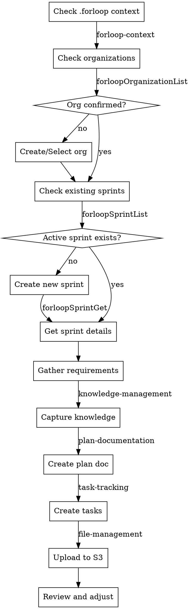

# Sprint Planning with ForLoop

## Overview
Structured approach to sprint planning using ForLoop tools. Creates actionable sprints with well-defined goals and appropriately sized stories. Integrates with `~/.forloop/sprint-{id}/` for persistent context.

This is planning-only: do not write or modify user application code. Convert plans into stories using ForLoop tools.

For web development planning, assume the default ForLoop tech stack (React 18 + Vite, Lambda Node.js 20, DynamoDB, Terraform). See `tech-stack-default` skill. Do NOT ask users to confirm these choices.

When a sprint is created with a project name, a GitHub repo `sprint-{id}-project-{name}` is automatically created with the full project-base template (frontend, backend, infra, CI/CD). Do NOT plan repo creation or CI/CD setup — these are handled automatically.

## Organization Requirement (MANDATORY)

**Before creating any sprint, you MUST confirm the organization:**

1. Call `forloopOrganizationList` to get all organizations
2. **No organizations:** Guide user to create one first with `forloopOrganizationCreate`
3. **One organization:** Confirm "Using organization '{name}' (ID: {id}) for this sprint?"
4. **Multiple organizations:** List them all and ask the user to select one

The organization ID must be:
- Stored in `~/.forloop/manifest.json` as `activeOrganizationId`
- Passed to `forloopSprintCreate` as the `organizationId` parameter
- Written to the project's `forloop.json` as `organizationId`

**Never create a sprint without a confirmed organization ID.**

## When to Use
- Starting a new sprint cycle
- Need to organize backlog into sprints
- Planning sprint goals and capacity

## When NOT to Use
- Mid-sprint story additions (use story-creation skill)
- Sprint modifications (use story-update workflow)

## Process Flow



## Checklist

### Session Start (ALWAYS FIRST)
- [ ] Run forloop-context skill to load `~/.forloop/manifest.json` context
- [ ] Check manifest.json for active sprint
- [ ] Review loaded knowledge, plans, and tasks from `~/.forloop/sprint-{id}/`

### Before Planning:
- [ ] **Check organizations** — call `forloopOrganizationList`
- [ ] **Confirm organization ID** — if multiple orgs, ask user to select
- [ ] **Create organization if needed** — if no orgs, guide user to create one
- [ ] Verify team availability for sprint period
- [ ] Review backlog priorities
- [ ] Check velocity from previous sprints
- [ ] Confirm sprint context with user

During Planning:
- [ ] Set sprint duration (typically 2 weeks)
- [ ] Define sprint goal/theme
- [ ] Capture requirements to knowledge (knowledge-management)
- [ ] Create plan document (plan-documentation)
- [ ] Create stories with clear acceptance criteria
- [ ] Use task-tracking for story creation
- [ ] Estimate story points (story-points skill via task-tracking)
- [ ] Balance capacity vs. committed points
- [ ] Upload all files to S3 (file-management)
- [ ] Update `~/.forloop/manifest.json` (v2 format with sprintDir)

## Hard Gate

**DO NOT create ANY stories or tasks until:**
1. Requirements gathered (knowledge-management)
2. Plan document created (plan-documentation)
3. User EXPLICITLY approves plan ("confirm" or "yes")

This applies to EVERY sprint regardless of perceived simplicity.

## Requirements Gathering Rules

- Ask ONE question at a time
- Wait for user response before next question
- Break complex topics into multiple questions
- Use multiple-choice when possible (easier to answer)

## Capacity Planning Options

When discussing sprint capacity, present 2-3 approaches:

**Option A: Conservative (Recommended)**
- Use 60% focus factor
- Buffer for unexpected issues
- Higher likelihood of on-time completion

**Option B: Standard**
- Use 80% focus factor  
- Normal risk tolerance
- Based on historical velocity

**Option C: Aggressive**
- Use 100% focus factor
- High risk, requires no interruptions
- Only for time-critical sprints

## Context Discovery (NEW - ALWAYS FIRST)

**Before any planning, run forloop-context skill:**

1. Check `~/.forloop/` folder existence
2. Load manifest.json (if exists)
3. Load knowledge, plans, and tasks from `~/.forloop/sprint-{id}/`
4. Present context summary to user
5. Confirm active sprint with user

```
# Context check happens automatically via forloop-context skill
# Falls back to scanning if no manifest
```

**After context loaded:**
- Summarize existing sprint context
- Ask: "Continue with sprint #{id} or start new?"

## Tool Usage

### Context Loading (NEW - First Step)
```
# Automatically via forloop-context skill
# Loads `~/.forloop/manifest.json` and folder contents
```

### List existing sprints
```
forloopSprintList()
```

### Get sprint details
```
forloopSprintGet(sprintId=<id>)
```

### Add stories to sprint
```
# Via task-tracking skill (recommended)
# or direct:
forloopStoryCreate(
  title="As a user, I want...",
  sprintId=<id>,
  priority=high
)
```

### Set story points
```
# Via task-tracking skill (recommended)
# or direct:
forloopStoryUpdate(
  storyId=<id>,
  points=5
)
```

## Integrated Skills Workflow

### Complete Sprint Planning Flow

1. **Session Start** → `forloop-context`
   - Load `~/.forloop/sprint-{id}/` context
   - Present context summary

2. **Organization Check** → `forloopOrganizationList`
   - List organizations
   - Confirm or select organization
   - Store `activeOrganizationId` in manifest

3. **Requirements Gathering** → `knowledge-management`
   - Capture domain knowledge
   - Document decisions

4. **Plan Creation** → `plan-documentation`
   - Q&A with user
   - Confirm requirements
   - Create plan file
   - Update manifest
   - Upload to S3

5. **Task Creation** → `task-tracking`
   - Read plan file
   - Break into tasks
   - Estimate points (`story-points`)
   - Apply templates (`template-based-tasks`)
   - Create stories
   - Write task file
   - Update manifest
   - Upload to S3

6. **Verification** → `file-management`
   - Verify S3 sync
   - Confirm file uploads

## Story Creation Guidelines

### Web Development Deployment Assumption

Always plan for:

- AWS serverless hosting managed by ForLoop
- CI/CD and infrastructure expressed as stories (IaC, IAM, secrets, observability)
- Deployment validation as acceptance criteria (smoke tests, health checks)

**Good story format:**
- **Title**: Actionable outcome ("Implement login page")
- **Description**: User story format ("As a [user], I want [feature], so that [benefit]")
- **Priority**: high/medium/low based on sprint goals
- **Points**: Use Fibonacci-like scale (0, 1, 2, 3, 5, 8, 10)

**INVEST criteria:**
- Independent (minimal dependencies)
- Negotiable (flexible implementation)
- Valuable (clear user benefit)
- Estimable (can size the effort)
- Small (fits within sprint)
- Testable (verifiable completion)

## Capacity Planning

**Typical velocity:**
- New team: 15-20 points per sprint
- Established team: Use average of last 3 sprints
- Reduce capacity for holidays, on-call, meetings

**Example calculation:**
```
Team members: 3 developers
Days available: 10 (2 weeks)
Focus factor: 0.6 (meetings, email, support)
Effective days: 10 × 0.6 = 6 days per developer
Total capacity: 3 × 6 = 18 developer-days
Average story: 3 points = 1.5 days
Recommended sprint load: 18 / 1.5 = ~12 points
```

## Common Mistakes

❌ **Over-committing**: Loading sprint beyond team capacity
→ Fix: Use historical velocity, not optimistic estimates

❌ **Vague stories**: "Improve performance" without metrics
→ Fix: "Reduce page load from 3s to 1s"

❌ **Missing dependencies**: Not identifying external blockers
→ Fix: Review each story for API, design, infrastructure needs

## Red Flags - STOP

**If you catch yourself:**
- About to create stories before plan approved
- Expressing satisfaction before verification ("Great!", "Sprint planned!")
- Thinking "just this once" skip hard gate
- Skipping capacity discussion
- About to claim complete without running verification

**ALL of these mean: STOP. Follow the process first.**

## Verification

Before completing sprint planning:
- [ ] Context loaded from .forloop/ folder
- [ ] Sprint has clear, measurable goal
- [ ] Total points within team capacity
- [ ] All stories have acceptance criteria
- [ ] Dependencies identified and addressed
- [ ] Stories align with sprint goal
- [ ] Knowledge files created and uploaded
- [ ] Plan file created and uploaded
- [ ] Task file created and uploaded
- [ ] Manifest.json updated
- [ ] S3 sync verified

## Compliance

**All rules in this skill are mandatory.** The hard gate (no stories before plan approval) must never be bypassed.

## Anti-Patterns

| # | ❌ Don't | ✅ Do Instead |
|---|---------|--------------|
| 1 | Create stories before plan is approved | Follow hard gate: requirements → plan → confirm → stories |
| 2 | Over-commit beyond team capacity | Use 60% focus factor for conservative planning |
| 3 | Write vague stories without acceptance criteria | Use Given/When/Then format |
| 4 | Skip capacity planning discussion | Present 2-3 capacity options to user |
| 5 | Write application code during planning | This skill is planning-only — convert plans to stories via tools |
| 6 | Skip ~/.forloop/ context check | Always run forloop-context skill first |
| 7 | Ask multiple questions at once | Ask ONE question at a time, wait for response |
| 8 | Create sprint without confirming organization | Always call `forloopOrganizationList` and confirm org ID first |
| 9 | Forget to write organizationId to forloop.json | Include `organizationId` in forloop.json when sprint is created |

## Quality Gates

- [ ] forloop-context skill ran and context loaded
- [ ] Organization confirmed (activeOrganizationId stored in manifest)
- [ ] Sprint goal is clear and measurable
- [ ] Total story points within team capacity (60% focus factor)
- [ ] All stories have acceptance criteria
- [ ] Dependencies identified and addressed
- [ ] Stories align with sprint goal
- [ ] Knowledge files created and uploaded to S3
- [ ] Plan file created and uploaded to S3
- [ ] Task file created and uploaded to S3
- [ ] manifest.json updated (includes activeOrganizationId)
- [ ] forloop.json updated with organizationId
- [ ] S3 sync verified via `forloopFileList`

## Integration with Other Skills

| Skill | Integration Point |
|-------|-------------------|
| `forloop-context` | Session startup, context loading |
| `knowledge-management` | Captures requirements and decisions |
| `plan-documentation` | Creates sprint plan documents |
| `task-tracking` | Creates stories from plan |
| `story-points` | Estimation (called by task-tracking) |
| `template-based-tasks` | Story templates (called by task-tracking) |
| `file-management` | S3 upload verification |
