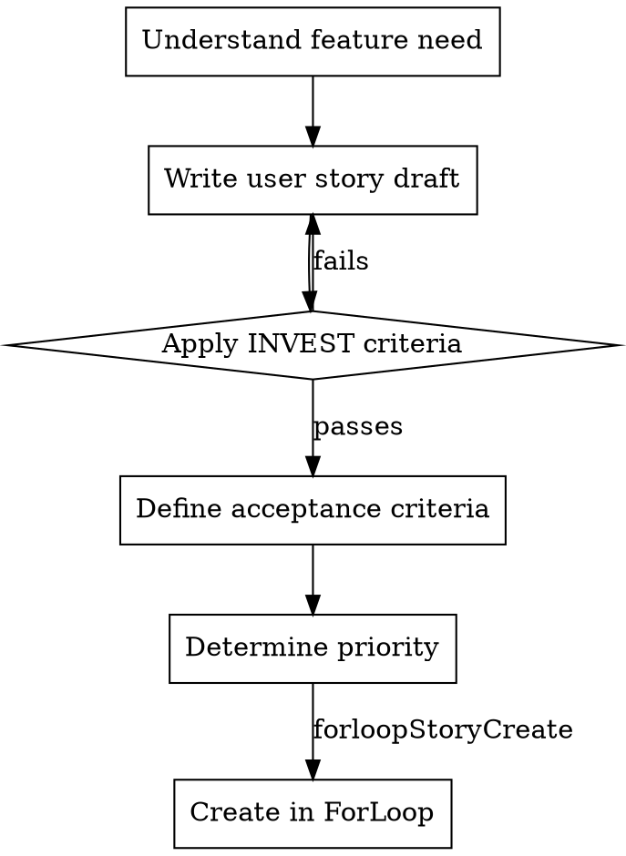

# Story Creation with ForLoop

## Overview
Creating well-structured user stories that are clear, actionable, and testable. Follows INVEST principles for quality backlog items.

## When to Use
- Adding new features to backlog
- Breaking epics into smaller stories
- Refining story descriptions and criteria
- Preparing stories for sprint planning

## Planning-Only Rule

This skill produces backlog stories only. Do not implement the feature in code.

For web development planning, assume deployment is handled by ForLoop on AWS using a serverless approach, and include deployment-related acceptance criteria where relevant.

## Process Flow



## User Story Template

**Standard format:**
```
As a [type of user],
I want [goal/desire],
So that [benefit/value].
```

**Examples:**

| Good | Bad |
|------|-----|
| "As a shopper, I want to filter by size, so I can find clothes that fit" | "Add size filter" |
| "As an admin, I want to export user reports as CSV, so I can analyze in Excel" | "CSV export feature" |

## Acceptance Criteria Format

Use **Given/When/Then** format:

```gherkin
Given [context]
When [action]
Then [expected result]
```

**Example for login story:**
```
Given I am on the login page
When I enter valid credentials and click "Sign In"
Then I should be redirected to the dashboard
And I should see a welcome message with my name
```

## Tool Usage

### Create a story from template (PREFERRED)

**For implementation tasks:**
```
forloopStoryTemplate(
  templateSlug=basic-task,
  taskTitle="As a user, I want to reset my password",
  description="Users can request password reset via email",
  sprintId=<id>,
  priority=high,
  points=3
)
```

**For documentation/note stories:**
```
forloopStoryTemplate(
  templateSlug=basic-note,
  taskTitle="As a user, I want to reset my password",
  description="Users can request password reset via email",
  sprintId=<id>,
  priority=high
)
```

### Create a story directly (use only for doc_folder types)
```
forloopStoryCreate(
  title="Story title",
  description="Description",
  sprintId=<id>,
  priority=high,
  type=doc_folder
)
```

### Update story details
```
forloopStoryUpdate(
  storyId=<id>,
  description="Updated with acceptance criteria..."
)
```

### List available templates
```
forloopTemplateList()
```

### Verify story created
```
forloopSprintGet(sprintId=<id>, includeStories=true)
```

## INVEST Checklist

Before creating story, verify:

| Criterion | Questions to Ask |
|-----------|-----------------|
| **Independent** | Can this be developed separately? Minimal dependencies? |
| **Negotiable** | Is implementation flexible? Open to discussion? |
| **Valuable** | Clear user benefit? Business value obvious? |
| **Estimable** | Team can size it? No unknown tech? |
| **Small** | Fits in one sprint? Can be completed in days, not weeks? |
| **Testable** | Clear pass/fail criteria? Measurable outcome? |

## Story Sizing Guidelines

| Points | Effort | Example |
|--------|--------|---------|
| 1 | < 4 hours | Bug fix, copy change |
| 2 | 4-8 hours | Simple feature |
| 3 | 1-2 days | Moderate feature |
| 5 | 2-4 days | Complex feature |
| 8 | 1+ weeks | Epic - should split |
| 10 | Multiple weeks | Must decompose |

**Rule**: Stories > 5 points should be split into smaller stories.

## Common Mistakes

❌ **Technical tasks as stories**: "Refactor database schema"
→ Fix: "As a developer, I want normalized schema, so queries are faster"

❌ **Missing "so that"**: No clear benefit stated
→ Fix: Always articulate the value

❌ **Combined stories**: "Login and registration"
→ Fix: Split into separate stories

❌ **Vague acceptance criteria**: "Works properly"
→ Fix: Specific, measurable outcomes

## Compliance

**All stories must pass INVEST criteria before creation.** Stories exceeding 5 points must be split.

## Anti-Patterns

| # | ❌ Don't | ✅ Do Instead |
|---|---------|--------------|
| 1 | Write technical tasks without user value | Frame as "As a [user], I want [goal], so that [benefit]" |
| 2 | Combine multiple features in one story | Split into independent stories |
| 3 | Write vague acceptance criteria ("works properly") | Use Given/When/Then with specific outcomes |
| 4 | Skip the "so that" clause | Always articulate the benefit/value |
| 5 | Create stories > 5 points | Split into smaller stories |
| 6 | Implement code during story creation | This is planning-only — use `forloopStoryCreate` tool |

## Quality Gates

- [ ] Story follows "As a [user], I want [goal], so that [benefit]" format
- [ ] Acceptance criteria use Given/When/Then format
- [ ] Story passes all INVEST criteria
- [ ] Story is ≤ 5 points (split if larger)
- [ ] Priority set (high/medium/low)
- [ ] Story created via `forloopStoryTemplate` with appropriate `templateSlug` (use `basic-task` for implementation, `basic-note` for documentation)
- [ ] Story verified via `forloopSprintGet(includeStories=true)`

## Anti-Patterns

| # | ❌ Don't | ✅ Do Instead |
|---|---------|--------------|
| 1 | Write technical tasks without user value | Frame as "As a [user], I want [goal], so that [benefit]" |
| 2 | Combine multiple features in one story | Split into independent stories |
| 3 | Write vague acceptance criteria ("works properly") | Use Given/When/Then with specific outcomes |
| 4 | Skip the "so that" clause | Always articulate the benefit/value |
| 5 | Create stories > 5 points | Split into smaller stories |
| 6 | Implement code during story creation | This is planning-only — use `forloopStoryTemplate` tool |
| 7 | Create stories without a template | Always use `templateSlug=basic-task` or `basic-note` |

## Examples

**Epic → Stories decomposition:**

Epic: "User Authentication System"

Stories:
1. "As a user, I want to register with email/password" (5 pts)
2. "As a user, I want to login with credentials" (3 pts)
3. "As a user, I want to reset my password" (3 pts)
4. "As a user, I want to logout securely" (2 pts)
