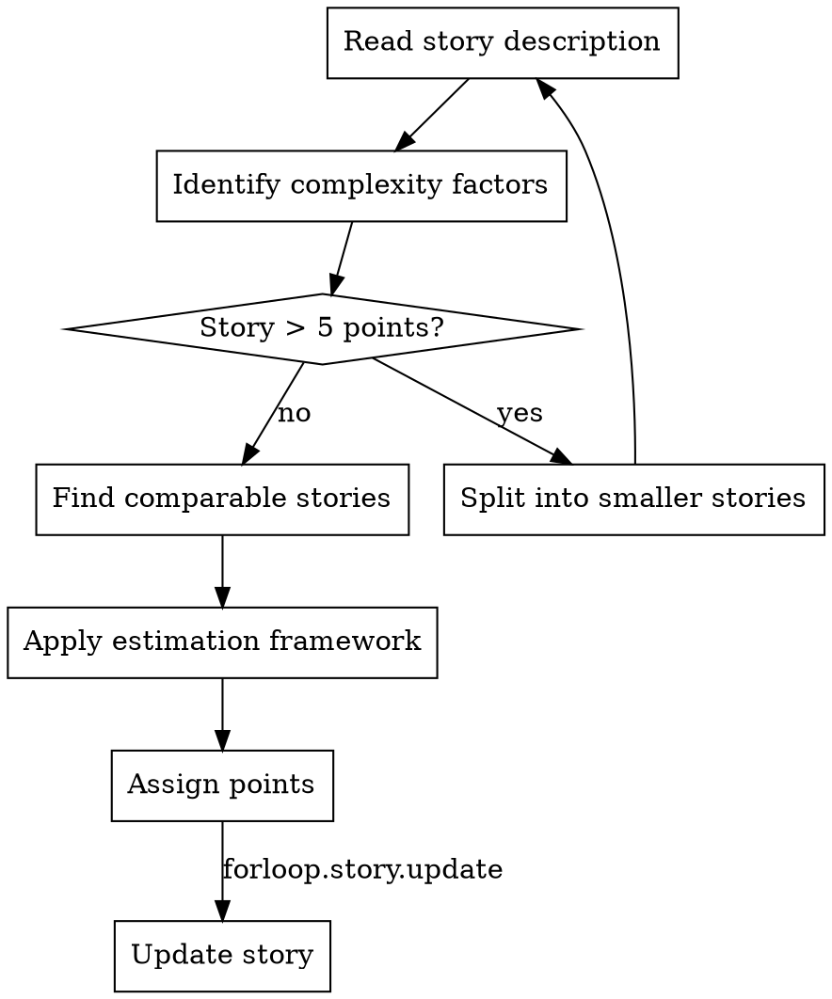

# Story Point Estimation with ForLoop

## Overview
Systematic approach to estimating story complexity using multiple factors. Provides consistent, team-aligned point assignments.

## When to Use
- Story refinement sessions
- Sprint planning (before committing)
- Re-estimating after new information
- Calibrating team estimation

## Estimation Framework

Consider four dimensions:

### 1. Complexity
How technically complex is the implementation?
- New vs. familiar technology
- Algorithm complexity
- Integration points

### 2. Effort
How much total work is required?
- Code volume
- Number of components affected
- Documentation needs

### 3. Uncertainty
What unknowns exist?
- Dependencies on other teams
- Unproven technology
- Unclear requirements

### 4. Risk
What could go wrong?
- Potential for regressions
- Testing complexity
- Deployment complexity

## Process Flow



**Key Decision:** Stories > 5 points should be split before estimating.

## Points Reference Scale

| Points | Meaning | Typical Effort | Example |
|--------|---------|----------------|---------|
| 0 | Trivial | < 30 min | Copy fix, config change |
| 1 | Very small | 2-4 hours | Simple bug fix |
| 2 | Small | 4-8 hours | Minor feature |
| 3 | Medium | 1-2 days | Standard feature |
| 5 | Large | 2-4 days | Complex feature |
| 8 | Very large | 1+ week | Should split |
| 10 | Epic | Multiple weeks | Must decompose |

## Tool Usage

### Get stories for estimation
```
forloop.sprint.get(sprintId=<id>, includeStories=true)
```

### Update story with points
```
forloop.story.update(storyId=<id>, points=5)
```

### Verify update
```
forloop.story.get(storyId=<id>)
```

**Verify points field is populated in response. If not, retry update.**

## Estimation Techniques

### Triangulation
Compare with already-estimated stories:
```
"If password reset (3 pts) is X effort, and this story feels harder,
then it should be 5 points"
```

### Affinity Mapping
Group similar stories, then assign points to groups:
```
Group A (similar effort): Stories 1, 3, 5 → 3 points each
Group B (higher effort): Stories 2, 4 → 5 points each
```

### Planning Poker (team)
- Each team member votes privately
- Discuss differences
- Re-vote until convergence

## Factors Checklist

Before assigning points, consider:

**Technical factors:**
- [ ] New technology or framework?
- [ ] Multiple files/components affected?
- [ ] External API integration?
- [ ] Database changes required?
- [ ] Performance requirements?

**Knowledge factors:**
- [ ] Team familiar with domain?
- [ ] Clear requirements?
- [ ] Available expertise on team?

**Testing factors:**
- [ ] Test infrastructure exists?
- [ ] Manual testing needed?
- [ ] Regression testing scope?

## Calibration Examples

**1-point stories:**
- Fix typo in error message
- Add index to database column
- Update help text

**3-point stories:**
- Add new API endpoint
- Create new React component
- Simple database migration

**5-point stories:**
- Integrate third-party payment service
- Implement search with filters
- Multi-step wizard flow

**8+ point stories (split these!):**
- "Build admin dashboard" → Split by feature
- "Migrate entire auth system" → Split by phase

## Common Mistakes

❌ **Averaging votes**: "Alice said 3, Bob said 8, let's call it 5"
→ Fix: Discuss WHY the difference, find misalignment

❌ **Time-based estimation**: "That's 2 days, so 3 points"
→ Fix: Points = complexity, not hours

❌ **Hero-based estimation**: "When I did it, took 1 hour"
→ Fix: Team estimate, not individual

❌ **Anchoring**: "I think it's 5... what did you say?"
→ Fix: Vote simultaneously

## Updating Estimates

Re-estimate when:
- Requirements change significantly
- Technical approach changes
- Dependencies resolved/added
- Team gains new information

**Process:**
1. Note reason for re-estimation in story comments
2. Update points: `forloop.story.update --storyId <id> --points <new>`
3. Verify update: `forloop.story.get --storyId <id>`
4. Track original vs. revised estimate for calibration

## Compliance

**Every story must have points assigned before creation.** Stories exceeding 5 points must be split first.

## Anti-Patterns

| # | ❌ Don't | ✅ Do Instead |
|---|---------|--------------|
| 1 | Use time-based estimation ("2 days = 3 points") | Points = complexity, not hours |
| 2 | Average conflicting votes without discussion | Discuss WHY the difference, find misalignment |
| 3 | Anchor others by voting first | Vote simultaneously |
| 4 | Skip estimation for "simple" stories | All stories need points |
| 5 | Create stories without points | Estimate first, default to 3 if unsure |
| 6 | Skip verification after points update | Run `forloop.story.get` to confirm |

## Quality Gates

- [ ] All four dimensions considered (complexity, effort, uncertainty, risk)
- [ ] Story > 5 points split before estimation
- [ ] Points assigned from Fibonacci scale (0, 1, 2, 3, 5, 8, 10)
- [ ] Points verified via `forloop.story.get` after update
- [ ] Re-estimation reason documented if changed

## Red Flags - STOP

**If you catch yourself:**
- Expression satisfaction before verifying points field
- Story points update failed but claiming successful
- Stories being created without points
- "The estimation looks right, no need to verify"
- Skipping estimation for "simple" stories

**ALL of these mean: STOP. Run verification first.**

## Rationalization Prevention

| Excuse | Reality |
|--------|---------|
| "Skip estimation, it's obvious" | All stories need points for capacity planning |
| "Points weren't updated, tool failed" | ALWAYS verify points field after update |
| "Just this one story, don't need points" | Consistency is critical for sprint planning |
| "I'll update points later" | Later never comes - estimate now |
