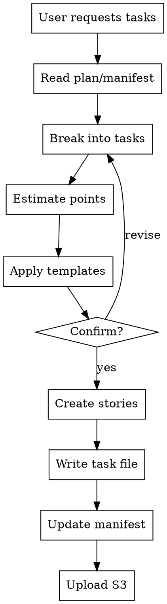

# Task Tracking with ForLoop

## Overview

Generates actionable task lists from plan documents, estimates story points, applies templates, creates stories in ForLoop, and maintains synchronized task files.

## When to Use

### Trigger Phrases

| User Request | Action |
|--------------|--------|
| "Create tasks for sprint X" | Generate task list |
| "Break down the plan into stories" | Task breakdown |
| "Create the stories" | Create stories in ForLoop |
| "Estimate and create stories" | Full workflow |

## When NOT to Use

- Without a plan document (use plan-documentation first)
- Single ad-hoc stories (use story-creation directly)
- Without confirming task breakdown with user

## Process Flow



## Workflow Steps

### Step 1: Read Plan File

Check manifest first: `~/.forloop/manifest.json`.

Get plan file from manifest. If missing, scan `~/.forloop/sprint-{sprintId}/plan/` for the latest `plan-{sprintId}-*.md`.

**Extract from plan:**
- Sprint goal
- In-scope features
- Requirements
- Constraints

### Step 2: Break Down into Tasks

**Convert plan items to tasks:**

```
Plan: "Implement user authentication system"

Tasks:
1. Create user registration API
2. Implement login endpoint
3. Add password reset flow
4. Create JWT token generation
5. Build auth middleware
```

**Task criteria:**
- Each task = one user story
- Tasks are independent (INVEST)
- Tasks deliver user value

### Step 3: Estimate Story Points

**Call story-points skill for each task:**

| Task | Complexity | Effort | Points |
|------|------------|--------|--------|
| Registration API | medium | 2 days | 5 |
| Login endpoint | low | 1 day | 3 |
| Password reset | medium | 2 days | 5 |
| JWT generation | medium | 2 days | 5 |
| Auth middleware | medium | 1 day | 3 |

**Point scale:**
| Points | Effort | Description |
|--------|--------|-------------|
| 1 | < 4 hours | Trivial |
| 2 | 4-8 hours | Small |
| 3 | 1-2 days | Moderate |
| 5 | 2-4 days | Complex |
| 8 | 1+ week | Split required |

**IMPORTANT:** Stories MUST have points assigned before creation. If points cannot be estimated, use default value of 3.

### Step 4: Apply Templates

**Call template-based-tasks skill:**

**Available templates:**
| Template | Use Case |
|----------|----------|
| `basic-task` | Standard feature |
| `bug-fix` | Bug resolution |
| `technical-debt` | Refactoring |
| `research` | Investigation, spikes |
| `documentation` | Docs, guides |

**Template fields:**
```yaml
templateSlug: basic-task
title: "Implement user registration"
description: "As a user, I want to register..."
priority: high
points: 5
assigneeAgentKey: forLoopDeveloper
```

### Step 5: Confirm with User

**Present proposed breakdown with agent assignments:**

```
📋 Proposed Task Breakdown for Sprint #14

| # | Task | Agent | Template | Points | Priority |
|---|------|-------|----------|--------|----------|
| 1 | Registration API | developer | basic-task | 5 | high |
| 2 | Login endpoint | developer | basic-task | 3 | high |
| 3 | Password reset | developer | basic-task | 5 | medium |
| 4 | JWT generation | developer | technical-debt | 5 | high |
| 5 | Auth middleware | developer | technical-debt | 3 | high |

**Agent Assignment Rules:**
- Implementation/features/bug fixes → `forLoopDeveloper`
- Testing/QA/validation → `forLoopTester`
- AWS/CI/CD/deployment/infrastructure → `forLoopDevops`
- Document/media generation → `forLoopCreator`

Total: 5 stories, 21 points

Confirm I should create these stories in ForLoop?
```

### Step 6: Create Stories in ForLoop

**Before creating stories, check for existing application knowledge:**
1. Read `knowledge-application.md` if loaded by forloop-context — understand current architecture and constraints
2. Check developer task status: `forloopDeveloperStatus(sprintId={sprintId})` — don't assign more work if ECS task is running

**Ensure doc_folder exists:**

```
forloopSyncAivyFolder(sprintId={sprintId})
```

**Get the doc_folder story ID:**

```
forloopAivyDocGet(sprintId={sprintId})
```

The tool will return the doc_folder story ID (e.g., `#123`).

**CRITICAL: ALL tasks created from a plan MUST use `templateSlug=basic-task`.** This is the default and only template for task breakdown. The `basic-note` template is only for standalone documentation/research stories, not for task breakdown.

**Available story templates:**

| Template Slug | Use Case | Story Type |
|--------------|----------|------------|
| `basic-task` | **ALL implementation tasks from plan breakdown** | `task` |
| `basic-note` | Standalone documentation, research, planning notes | `story` |

**Template selection for task tracking:**

| Scenario | Template Slug |
|----------|---------------|
| Breaking down a plan into tasks | `basic-task` |
| Feature implementation task | `basic-task` |
| Bug fix task | `basic-task` |
| Refactoring task | `basic-task` |
| Deployment/infrastructure task | `basic-task` |
| Planning/breakdown task | `basic-task` |
| Standalone research note (not from plan) | `basic-note` |

**For each task, determine agent assignment based on task type:**

| Task Type | assigneeAgentKey |
|-----------|------------------|
| Implementation, features, bug fixes, refactoring | `forLoopDeveloper` |
| Testing, QA, E2E, unit tests | `forLoopTester` |
| AWS, CI/CD, deployment, Terraform, infrastructure | `forLoopDevops` |
| Document/media generation | `forLoopCreator` |

**ALWAYS use `forloopStoryTemplate` with `templateSlug=basic-task` to create stories from plan breakdown.** This ensures the story has a `templateId` set, proper metadata structure, and renders correctly on the sprint canvas.

**Create stories with template, agent assignment, and points:**

```
forloopStoryTemplate(
  templateSlug=basic-task,
  taskTitle="Implement user registration API",
  sprintId=14,
  priority=high,
  points=5,
  assigneeAgentKey=developer
)
```

For documentation/note stories:

```
forloopStoryTemplate(
  templateSlug=basic-note,
  taskTitle="Research authentication patterns",
  sprintId=14,
  priority=medium,
  points=3
)
```

**Store returned story IDs:**
```json
[
  {"task": 1, "storyId": 201, "assigneeAgentKey": "forLoopDeveloper"},
  {"task": 2, "storyId": 202, "assigneeAgentKey": "forLoopDeveloper"}
]
```

**BEFORE claiming complete:**
1. Run: `forloopSprintGet(sprintId={sprintId}, includeStories=true)`
2. Verify: All story IDs appear in response
3. Verify: Each story has `points` field populated
4. Verify: Each story has correct `assigneeAgentKey`
5. For done/in-progress stories, check implementation: `forloopStoryGet(storyId={id}, includeComments=true)`
6. ONLY THEN: Claim "Stories created successfully"

### Step 7: Write Task List File

**Location:** `.forloop/sprint-{sprintId}/task/task-{sprintId}-{datetime}.md`

**Template:**
```markdown
# Task List - Sprint #{sprintId}

## Metadata
- **Created:** {datetime}
- **Source Plan:** plan-{sprintId}-{datetime}.md
- **Author:** ForLoop Planner Agent

## Summary

| Total Stories | Total Points | Completed | In Progress | Pending |
|---------------|--------------|-----------|-------------|---------|
| {count} | {points} | {count} | {count} | {count} |

## Stories Created

| Story ID | Title | Template | Points | Priority | Status |
|----------|-------|----------|--------|----------|--------|
| {id} | {title} | {slug} | {pts} | {priority} | created |

## Story Details

### Story #{storyId}
- **Title:** {title}
- **Template:** {slug}
- **Points:** {pts}
- **Priority:** {priority}
- **Description:**
  ```
  As a {user}, I want {feature}, so that {benefit}
  ```
- **ForLoop Link:** https://app.forloop.cc/story/{id}

---
*Generated by ForLoop Planner Agent*
*Synchronized to S3*
```

### Step 8: Update Manifest

**Update `~/.forloop/manifest.json`:**

```json
{
  "version": 2,
  "activeSprintId": {sprintId},
  "sprints": {
    "{sprintId}": {
      "sprintDir": "sprint-{sprintId}",
      "plan": { ... },
      "tasks": {
        "file": "sprint-{sprintId}/task/task-{sprintId}-{datetime}.md",
        "storyIds": ["201", "202", "203"]
      }
    }
  }
}
```

### Step 9: Upload to S3

**Use the doc_folder story ID from Step 6:**

Get it with:
```
forloopAivyDocGet(sprintId={sprintId})
```

Returns: `#123 forloop Aivy doc`

**Upload with doc_folder linking:**

```
forloopSyncLocalToS3(
  filePath=.forloop/sprint-{sprintId}/task/task-{sprintId}-{datetime}.md,
  sprintId={sprintId},
  folder=project/tasks,
  storyId=123
)
```

**BEFORE claiming complete:**
 1. Run: `forloopFileList(sprintId={sprintId})`
 2. Verify: Task file appears in list under `project/tasks/` folder
 3. ONLY THEN: Claim "Task file uploaded successfully"

## Red Flags - STOP

**If you catch yourself:**
- Expressing satisfaction before verification ("Great!", "Perfect!", "Done!")
- About to claim stories created without running `forloopSprintGet(sprintId={sprintId}, includeStories=true)`
- About to claim task uploaded without running `forloopFileList`
- Thinking "just this once" skip verification
- Tool returned success but you haven't verified
- Stories created without points assigned
- Stories suitable for agents left unassigned
- Task file uploaded to wrong S3 path (should be project/tasks/)

**ALL of these mean: STOP. Run verification first.**

## Task Status Updates

**Status values:**
- `not-started` - Story created, work not begun
- `in-progress` - Currently being worked on
- `review` - Ready for review
- `done` - Completed and accepted

**Update workflow:**
1. Read existing task file
2. Update story status
3. Create new version file
4. Upload to S3

## Examples

### Example 1: Full Task Creation

**User:** "Create tasks for sprint 14"

**Workflow:**
1. Read plan: `.forloop/sprint-{sprintId}/plan/plan-14-20260410-093015.md`
2. Break into 5 tasks
3. Estimate: 5, 3, 5, 5, 3 = 21 points
4. Apply templates with agent assignments:
   - "Implement registration API" → developer (implementation)
   - "Write sprint plan" → planner (planning task)
   - "Deploy to AWS" → deployer (deployment task)
5. Confirm with user
6. Create stories via `forloopStoryTemplate` with:
   - `--points` set to estimated value
   - `--assigneeAgentKey` set based on task type
7. Verify stories created with points and agents:
   ```
   forloopSprintGet(sprintId=14, includeStories=true)
   ```
8. Write: `.forloop/sprint-{sprintId}/task/task-14-20260410-100000.md`
9. Update manifest
10. Upload to S3 with doc_folder linking

### Example 2: Task Status Update

**User:** "Mark story 201 as complete"

**Workflow:**
1. Read task file
2. Update story 201 status to "done"
3. Create new version
4. Upload to S3

## Integration with Other Skills

| Skill | Integration |
|-------|-------------|
| `plan-documentation` | Reads plan for tasks |
| `story-points` | Called for estimation (MUST assign points) |
| `template-based-tasks` | Called for story creation |
| `agent-auto-assignment` | Determines correct agent for each task |
| `story-creation` | Fallback for templates |
| `knowledge-management` | Capture decisions |
| `file-management` | S3 upload pattern |
| `forloop-context` | Loads tasks on startup |

## File Organization

### S3 Folder Structure

Files are uploaded to S3 with the following structure:

```
sprint/{sprintId}/
├── project/
│   ├── plans/
│   │   └── plan-{sprintId}-{datetime}.md
│   ├── knowledge/
│   │   └── knowledge-{topic}-{datetime}.md
│   └── tasks/
│       └── task-{sprintId}-{datetime}.md
```

### Folder Mapping

| Local Path | S3 Folder | Parameter |
|------------|-----------|-----------|
| `.forloop/sprint-{id}/plan/*` | `project/plans/` | `--folder project/plans` |
| `.forloop/sprint-{id}/knowledge/*` | `project/knowledge/` | `--folder project/knowledge` |
| `.forloop/sprint-{id}/task/*` | `project/tasks/` | `--folder project/tasks` |

The `forloopSyncLocalToS3` tool auto-infers the folder from the local path, but explicit `--folder` parameter is recommended.

### Doc Folder Linking

All plan, knowledge, and task files should be linked to the doc_folder story:

1. Create/verify doc_folder: `forloopSyncAivyFolder(sprintId={id})`
2. Get doc_folder ID: `forloopAivyDocGet(sprintId={id})`
3. Upload with linking: `forloopSyncLocalToS3(filePath=..., sprintId={id}, storyId={docFolderId})`

This enables logical grouping of all ForLoop-generated documents.

## Troubleshooting

### Issue: Story creation fails

**Check:**
```
forloopTokenGet()
forloopSprintGet(sprintId={id})
forloopTemplateList()
```

### Issue: Task file not created

**Solution:**
```bash
mkdir -p .forloop/sprint-{sprintId}/task
chmod 755 .forloop/sprint-{sprintId}/task
```

### Issue: Points not estimated

**Solution:**
Always call story-points skill before story creation. If estimation fails, use default value of 3.

### Issue: Agent not assigned to story

**Check:**
1. Is the agent enabled for the sprint? Run: `forloopSprintGet(sprintId={id})`
2. If not enabled, run: `forloopSprintAiAgentsUpdate(sprintId={id}, enabledAgentKeys=["forLoopDeveloper","forLoopTester","forLoopDevops","forLoopCreator"])`
3. Use `agent-auto-assignment` skill to determine correct agent

### Issue: S3 upload in wrong folder

**Solution:**
1. Ensure `folder=project/{plans,knowledge,tasks}` is passed
2. Or ensure local path starts with `knowledge/`, `plan/`, or `task/`
3. Verify upload: `forloopFileList(sprintId={id})`

## Best Practices

### Do
- ✅ Always read plan first
- ✅ Confirm breakdown with user
- ✅ Use appropriate templates
- ✅ Estimate before creating (Mandatory)
- ✅ Assign agents based on task type
- ✅ Upload files with correct folder path
- ✅ Link files to doc_folder
- ✅ Upload immediately
- ✅ Update manifest
- ✅ Verify story points assigned
- ✅ Verify agent assignment

### Don't
- ❌ Create tasks without plan
- ❌ Skip confirmation
- ❌ Create stories > 8 points
- ❌ Create stories without points
- ❌ Leave agent-suitable stories unassigned
- ❌ Upload to wrong S3 folder
- ❌ Forget manifest update
- ❌ Skip S3 upload
- ❌ Skip verification steps

## Compliance

**Stories MUST have points assigned before creation.** User confirmation is required before creating any stories. **ALL stories MUST be created via `forloopStoryTemplate` with `templateSlug=basic-task`** — never use `forloopStoryCreate` for regular stories.

## Anti-Patterns

| # | ❌ Don't | ✅ Do Instead |
|---|---------|--------------|
| 1 | Create stories without reading plan first | Always read plan document before breaking into tasks |
| 2 | Create stories > 8 points | Split into smaller stories |
| 3 | Create stories without points | Estimate first, default to 3 if unsure |
| 4 | Leave agent-suitable stories unassigned | Classify task type and assign correct agent (forLoopDeveloper/forLoopTester/forLoopDevops/forLoopCreator) |
| 5 | Upload task file to wrong S3 folder | Use `folder=project/tasks` |
| 6 | Skip doc_folder linking | Link to doc_folder story for organization |
| 7 | Skip manifest update | Always update `~/.forloop/manifest.json` with v2 format |
| 8 | Skip verification after story creation | Run `forloopSprintGet(sprintId={sprintId}, includeStories=true)` |
| 9 | Create task stories without `templateSlug=basic-task` | ALWAYS use `templateSlug=basic-task` for all task breakdown stories |

## Quality Gates

- [ ] `knowledge-application.md` reviewed (understand current architecture before task breakdown)
- [ ] Developer task status checked via `forloopDeveloperStatus` (don't over-assign if ECS is running)
- [ ] Plan document read and extracted
- [ ] Tasks broken down from plan (INVEST-compliant)
- [ ] Points estimated for every story (default 3 if unsure)
- [ ] Templates applied to each task
- [ ] Agent assignment determined per task type (forLoopDeveloper/forLoopTester/forLoopDevops/forLoopCreator)
- [ ] User confirmed breakdown before creation
- [ ] Stories created via `forloopStoryTemplate`
- [ ] Story IDs verified via `forloopSprintGet(sprintId={sprintId}, includeStories=true)`
- [ ] Story implementation details checked: `forloopStoryGet(storyId={id}, includeComments=true)` for done/in-progress stories
- [ ] Each story has `points` field populated
- [ ] Each story has correct `assigneeAgentKey`
- [ ] Task file written to `.forloop/sprint-{sprintId}/task/task-{sprintId}-{datetime}.md`
- [ ] manifest.json updated
- [ ] Task file uploaded to `project/tasks/` S3 folder
- [ ] Upload verified via `forloopFileList`
- [ ] Upload verified via `forloopFileList`

## Rationalization Prevention

| Excuse | Reality |
|--------|---------|
| "Skip verification, tool returned IDs" | Verify stories exist with forloopSprintGet |
| "User already confirmed the breakdown" | User confirmation ≠ technical verification |
| "Just these few stories, don't need full process" | Simple tasks need process too |
| "I'll upload the task file later" | Later never comes - upload immediately |
| "The stories look good in the list" | READ full output, confirm all IDs |
| "We're in a hurry, skip story points" | Estimation prevents over-commitment |
| "Agent assignment doesn't matter" | Wrong agent = stories won't be auto-processed |
| "Points weren't estimated, I'll skip them" | ALWAYS assign points (default to 3 if unsure) |
| "Stories suitable for agents left unassigned" | Check task type, assign to correct agent |
| "Files uploaded to wrong S3 folder" | Use --folder parameter, verify with forloopFileList |

---

**Version:** 1.0.0  
**Created:** 2026-04-10
