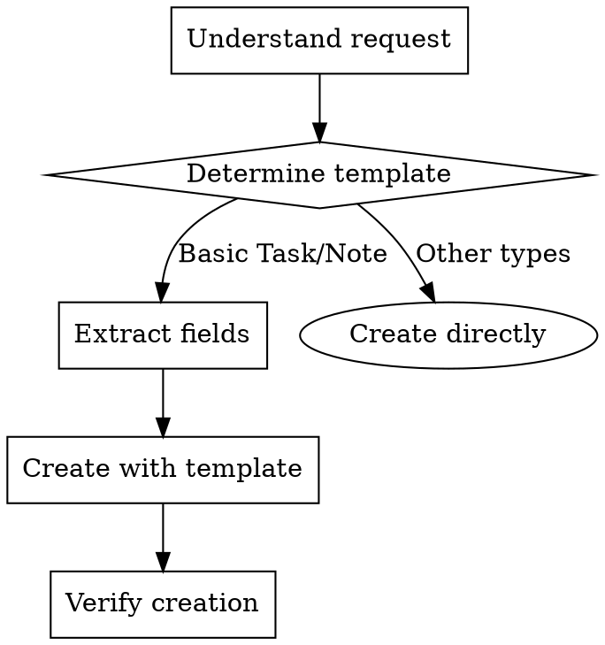

# Template-Based Task Creation with ForLoop

## Overview
Transform natural language requests into actionable ForLoop stories using templates. This skill ensures consistent task structure with proper metadata for AI agents and team collaboration.

## When to Use
- User requests task creation with requirements
- Creating tasks assigned to AI agents
- Standardizing team workflows
- Ensuring tasks have proper field structure

## When NOT to Use
- Simple notes without structure (use basic creation)
- Schedule meetings (use forloopScheduleCreate)
- Document folders (use forloopDocFolder)

## Process Flow



## Template Selection Guide

| User Request Pattern | Template | Story Type | Fields to Extract |
|---------------------|----------|------------|-------------------|
| "Create a task for [agent/person]" | basic-task | task | assignee, status, priority |
| "Add a to-do item" | basic-task | task | status (not-started), priority |
| "Track a bug" | (none) | bug | severity, reproducible |
| "Add a note" | basic-note | story | taskTitle, description |
| "Document [topic]" | basic-note | story | taskTitle, description |

## Task Creation Workflow

### Step 1: Understand Request

**Example Input:**
> "Create a task for the developer agent to review pull request #123"

**Extract:**
- Title: "Review PR #123"
- Description: "Review changes and provide feedback"
- Assignee: "forLoopDeveloper" (AI agent)
- Priority: implied "high" (PR review)
- Type: "task"

### Step 2: Choose Template

Based on the request pattern:
- Has assignee → **Basic Task**
- Needs status tracking → **Basic Task**
- Has priority → **Basic Task**

### Step 3: Create Story

**Tool Call:**
```
forloopStoryTemplate(
  templateSlug=basic-task,
  sprintId=14,
  taskTitle="Review PR #123",
  description="Review changes in feature branch and provide feedback",
  assigneeAgentKey=forLoopDeveloper,
  priority=high,
  points=3,
  status=not-started
)
```

### Step 4: Verify Creation

**Expected Response:**
```
✅ Story created with "Basic Task" template

**#79**: Review PR #123
**Sprint**: #14
**Template**: Basic Task
**Type**: task
**AI Agent**: developer
**Priority**: high
**Points**: 3
```

## Field Extraction Examples

### From "Review PR #456 and merge if tests pass"

```
taskTitle: "Review PR #456"
description: "Review PR and merge if tests pass"
assigneeAgentKey: "forLoopDeveloper"
status: "not-started"
priority: "high"
points: 3
```

### From "Add note about sprint goals"

```
taskTitle: "Sprint Goals Note"
description: "Document sprint goals and objectives"
status: "not-started" (maps to "todo")
priority: "medium"
points: 1
```

### From "Urgent: Fix login bug reported by customer"

```
taskTitle: "Fix login bug"
description: "Fix login bug reported by customer"
priority: "critical"
points: 5
status: "not-started"
```

## Tool Usage

### List Available Templates
```
forloopTemplateList()
```

**Expected Output:**
```
📋 Available Story Templates:

📝 **Basic Note** (`basic-note`)
   Standard note item with title and description
   Fields: Task Title, Description & Context

📝 **Basic Task** (`basic-task`)
   A basic task for tracking and managing with target dates and assignees
   Fields: Task Title, Description, Assignee, Status, Priority, Points, Due Date, Tags
```

### Create with Template
```
forloopStoryTemplate(
  templateSlug=basic-task,
  sprintId=14,
  taskTitle="Implement user authentication",
  assigneeAgentKey=forLoopDeveloper,
  priority=high,
  points=8
)
```

### Create without Template
```
forloopStoryCreate(
  title="Quick note",
  sprintId=14,
  type=story,
  priority=low
)
```

## Status Mapping

Template status values differ from database values:

| Template Status | Database Status |
|----------------|-----------------|
| `not-started` | `todo` |
| `in-progress` | `in_progress` |
| `completed` | `done` |

**The plugin automatically handles this mapping.**

## AI Agent Task Assignment

### Assigning to AI Agents

**Available Agent Keys (canonical):**
- `forLoopDeveloper` — Code development, implementation, bug fixes
- `forLoopTester` — Testing, QA, validation, lint, typecheck
- `forLoopDevops` — AWS infrastructure, CI/CD, deployment, Terraform
- `forLoopCreator` — Document/media generation (DOCX, PDF, XLSX, PPTX, music, images)

**Example:**
```
forloopStoryTemplate(
  templateSlug=basic-task,
  taskTitle="Write unit tests",
  assigneeAgentKey=forLoopDeveloper,
  priority=medium,
  points=5
)
```

**Metadata stored:**
```json
{
  "taskTitle": "Write unit tests",
  "description": "...",
  "assignee": "agent:developer",
  "status": "not-started",
  "priority": "medium",
  "points": 5
}
```

## Common Mistakes

### ❌ Forgetting Template

**Wrong:**
```
forloopStoryCreate(
  title="Task",
  sprintId=14
)
```

**Right:**
```
forloopStoryTemplate(
  templateSlug=basic-task,
  taskTitle="Task",
  sprintId=14
)
```

### ❌ Wrong Status Values

**Wrong:**
```
status=todo   # Template uses "not-started"
```

**Right:**
```
status=not-started  # Plugin maps to "todo"
```

### ❌ Missing Assignee Type

**Wrong:**
```
assigneeAgentKey=forLoopDeveloper  # Without type
```

**Right:**
```
assigneeAgentKey=forLoopDeveloper
assigneeType=agent  # Or let plugin auto-detect
```

## Verification Checklist

Before completing task creation:
- [ ] Template selected (basic-task or basic-note)
- [ ] Title extracted from request
- [ ] Description populated
- [ ] Assignee determined (user ID or agent key)
- [ ] Priority set based on urgency
- [ ] Story points estimated
- [ ] Status set to "not-started" (default)
- [ ] Sprint ID resolved

## Examples

### Example 1: Simple Task Request

**User:** "Add a task to review the documentation"

**Thought Process:**
1. Request type: Documentation review → Basic Task
2. Priority: Not specified → medium
3. Points: Documentation ~ 2 points
4. Assignee: Not specified → unassigned

**Action:**
```
forloopStoryTemplate(
  templateSlug=basic-task,
  sprintId=14,
  taskTitle="Review documentation",
  description="Review and update project documentation",
  priority=medium,
  points=2,
  status=not-started
)
```

### Example 2: Urgent Bug Fix

**User:** "Critical bug! Login is broken for mobile users"

**Thought Process:**
1. Request type: Bug fix → Basic Task (or type: bug)
2. Priority: "Critical" → critical
3. Points: Depends on complexity, estimate 5
4. Assignee: Urgent → developer agent

**Action:**
```
forloopStoryTemplate(
  templateSlug=basic-task,
  sprintId=14,
  taskTitle="Fix mobile login bug",
  description="Login is broken for mobile users",
  assigneeAgentKey=forLoopDeveloper,
  priority=critical,
  points=5,
  status=not-started
)
```

### Example 3: Meeting Notes

**User:** "Add notes from today's sprint planning meeting"

**Thought Process:**
1. Request type: Notes → Basic Note
2. Priority: Not specified → low
3. Points: Notes ~ 1 point
4. No assignee needed

**Action:**
```
forloopStoryTemplate(
  templateSlug=basic-note,
  sprintId=14,
  taskTitle="Sprint Planning Meeting Notes",
  description="Notes from sprint planning",
  priority=low,
  points=1
)
```

## Compliance

**All template-based task creation must use `forloopStoryTemplate`, not `forloopStoryCreate`.**

## Anti-Patterns

| # | ❌ Don't | ✅ Do Instead |
|---|---------|--------------|
| 1 | Use `forloopStoryCreate` for templated tasks | Use `forloopStoryTemplate` with `templateSlug=basic-task` |
| 2 | Use DB status values (`todo`) with templates | Use template status (`not-started`) — plugin maps automatically |
| 3 | Set `assigneeAgentKey` without `assigneeType=agent` | Include both, or let plugin auto-detect |
| 4 | Skip template for agent-assigned tasks | Templates ensure required metadata fields |
| 5 | Estimate points after creation | Points must be set at creation time |

## Quality Gates

- [ ] Correct template selected (basic-task or basic-note)
- [ ] Title extracted from user request
- [ ] Description populated
- [ ] Priority set based on urgency
- [ ] Story points estimated
- [ ] Status set to `not-started` (default)
- [ ] Sprint ID resolved
- [ ] Agent assignee determined (if applicable)
- [ ] Creation verified via tool response

## Integration with Other Skills

This skill works well with:

- **sprint-planning** - Creates tasks during sprint planning
- **story-points** - Helps estimate story points for tasks
- **user-management** - Assigns tasks to team members

## Rationalization Prevention

| Excuse | Reality |
|--------|---------|
| "Skip template, I'll use direct create" | Templates ensure consistent metadata |
| "Status mapping doesn't matter" | Wrong status breaks workflow tracking |
| "Assignee type is optional" | Missing assignee type causes agent confusion |
| "Just this one task, don't need template" | Consistent structure helps team and agents |
| "I'll estimate points later" | Points needed for capacity planning |
| "Template seems overkill for this" | Templates prevent missing critical fields |

---

**Version:** 1.0.0  
**Last Updated:** 2026-03-28
