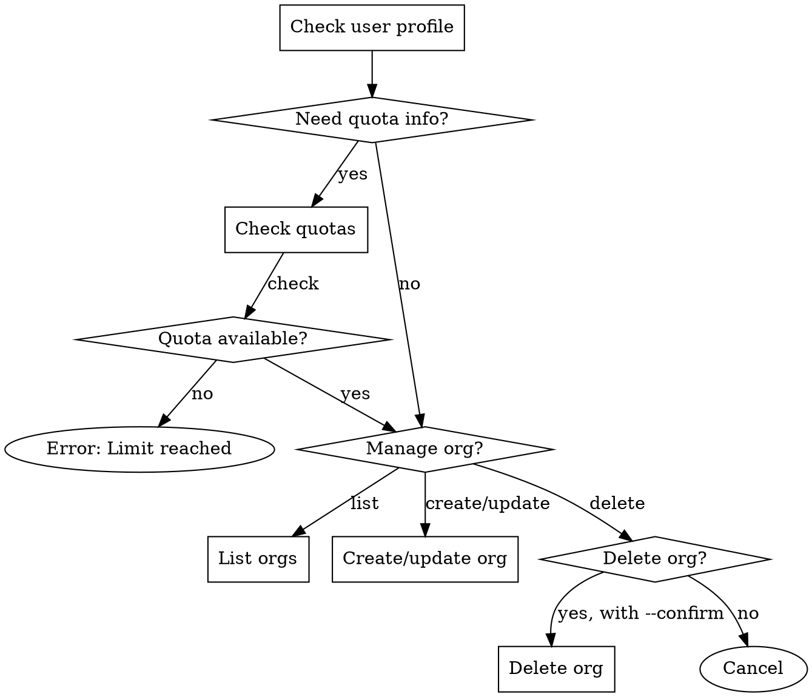

# User & Organization Management with ForLoop

## Overview
Manage user profiles, check quota limits, and administer organizations using ForLoop tools. This skill provides workflows for user and organization administration.

## When to Use
- User needs profile information
- Checking quota limits before creating resources
- Creating or managing organizations (paid feature)
- Managing team members

## When NOT to Use
- Story or sprint operations (use other skills)
- File management (use file-management skill)
- AI agent queries (use agent skills)

## Process Flow



---

## User Profile Workflow

### Check User Profile

**Tool:** `forloop.user.profile`

**Example:**
```
forloop.user.profile()
```

**Expected Output:**
```
👤 User Profile

**Name**: John Doe
**Email**: john@example.com
**Tier**: team
**Bio**: Engineering lead at ForLoop
**Avatar**: https://...
```

### Actions Based on Tier

**Free Tier:**
- Limited to 1 system sprint
- Max 20 stories per sprint
- Limited storage

**Team Tier:**
- Multiple organizations
- Multiple sprints per org
- Increased storage

**Enterprise Tier:**
- Unlimited organizations
- Maximum resources
- Priority support

---

## Quota Management Workflow

### Check User Quotas

**Tool:** `forloop.user.quotas`

**Example:**
```
forloop.user.quotas()
```

**Expected Output:**
```
📊 Quota Usage (team tier)

**Organizations**: 2/3
**System Sprints**: 1/5
**Storage**: 150 MB / 500 MB
**Free Stories**: 5/20

**Owned Organizations:**
  - Engineering Team: 3/10 sprints
  - Marketing Team: 1/10 sprints
```

### Quota Check Before Actions

**Before Creating Organization:**
```
# Check quotas first
forloop.user.quotas()

# If remaining > 0, proceed
forloop.organization.create(name="New Team")
```

**Before Creating Sprint:**
```
# Check system sprint quota
forloop.user.quotas()

# If remaining > 0, proceed
forloop.sprint.create(title="Sprint 43", startDate=...)
```

---

## Organization Management Workflow

### List Organizations

**Tool:** `forloop.organization.list`

**Example:**
```
# List all organizations
forloop.organization.list()

# List only owned organizations
forloop.organization.list(ownedOnly=true)
```

**Expected Output:**
```
🏢 Organizations:

👑 #1 **Engineering Team** (team)
   Role: owner
   Description: Core engineering team

👑 #2 **Marketing Team** (team)
   Role: owner
   Description: Marketing and growth

👤 #3 **Sales Team** (team)
   Role: member
   Description: Sales team org
```

### Create Organization

**Tool:** `forloop.organization.create`

**Prerequisites:**
- User must have Team or Enterprise tier
- Quota available (check with `forloop.user.quotas`)

**Example:**
```
forloop.organization.create(
  name="Product Team",
  description="Product management and design"
)
```

**Expected Output:**
```
✅ Organization created successfully!

**#4**: Product Team
**Type**: team
**Description**: Product management and design
```

### Update Organization

**Tool:** `forloop.organization.update`

**Requirements:**
- Must be owner of organization

**Example:**
```
forloop.organization.update(
  organizationId=1,
  name="Engineering Team 2.0",
  description="Updated description"
)
```

### Delete Organization

**Tool:** `forloop.organization.delete`

**⚠️ Warnings:**
- This action is PERMANENT
- All sprints, stories, and members are deleted
- Cannot be undone

**Example:**
```
# WARNING: This will delete everything!
forloop.organization.delete(
  organizationId=4,
  confirm=true
)
```

---

## Member Management

### Check Organization Members

**Tool:** `forloop.organization.get`

**Example:**
```
forloop.organization.get(organizationId=1)
```

**Expected Output:**
```
🏢 Organization #1

**Name**: Engineering Team
**Type**: team
**Description**: Core engineering team
**Created**: 3/1/2026
```

### Add Member

**Note:** Currently requires direct API call or UI.

### Remove Member

**Note:** Currently requires direct API call or UI.

---

## Organization Quotas

### Check Organization Quota

**Tool:** `forloop.organization.quotas`

**Example:**
```
forloop.organization.quotas(organizationId=1)
```

**Expected Output:**
```
📊 Organization Quotas

**Organization**: Engineering Team (#1)
**Type**: team

**Limits:**
  - Storage: 524288000 bytes

**Usage:**
  - Sprints: 3
```

---

## Common Scenarios

### Scenario 1: New User Onboarding

**Goal:** Set up new team member with proper access

**Steps:**
1. Check organization they should join
2. Add as member (via UI or admin)
3. Verify access

**Commands:**
```
# List organizations
forloop.organization.list()

# New user checks their profile
forloop.user.profile()
```

### Scenario 2: Reaching Quota Limits

**Goal:** Handle quota limit errors

**Symptoms:**
```
Error: Organization limit reached.
```

**Steps:**
1. Check current quotas
```
forloop.user.quotas()
```
   - Delete unused organization
   - Upgrade tier
   - Request quota increase

**Commands:**
```
# If deleting org
forloop.organization.delete(organizationId=4, confirm=true)

# Or upgrade tier via ForLoop UI
```

### Scenario 3: Team Expansion

**Goal:** Create new organization for growing team

**Prerequisites:**
- Check quota availability
- Ensure Team/Enterprise tier

**Steps:**
```
# Step 1: Check quotas
forloop.user.quotas()

# Step 2: Create organization
forloop.organization.create(
  name="Design Team",
  description="UX/UI design team"
)
```

---

## Tool Reference

### forloop.user.profile

**Purpose:** Get current user profile

**Arguments:** None

**Returns:** Name, email, tier, bio, avatar URL

---

### forloop.user.quotas

**Purpose:** Check user quota limits

**Arguments:** None

**Returns:** Quotas for organizations, sprints, storage, stories

---

### forloop.organization.quotas

**Purpose:** Get quota for specific organization

**Arguments:**
- `--organizationId` (required)

**Returns:** Sprint usage, storage limits

---

### forloop.organization.list

**Purpose:** List user's organizations

**Arguments:**
- `--ownedOnly` (optional, default: false)

**Returns:** List of organizations with roles

---

### forloop.organization.get

**Purpose:** Get organization details

**Arguments:**
- `--organizationId` (required)

**Returns:** Organization name, type, description

---

### forloop.organization.create

**Purpose:** Create new organization

**Arguments:**
- `--name` (required)
- `--description` (optional)

**Requirements:** Team/Enterprise tier, quota available

---

### forloop.organization.update

**Purpose:** Update organization details

**Arguments:**
- `--organizationId` (required)
- `--name` (optional)
- `--description` (optional)

**Requirements:** Owner permission

---

### forloop.organization.delete

**Purpose:** Delete organization permanently

**Arguments:**
- `--organizationId` (required)
- `--confirm` (required, boolean)

**Requirements:** Owner permission

---

## Compliance

**Organization deletion requires explicit confirmation and owner permission.** Always check quotas before creating resources.

## Anti-Patterns

| # | ❌ Don't | ✅ Do Instead |
|---|---------|--------------|
| 1 | Create organization without checking quota | Run `forloop.user.quotas` first |
| 2 | Delete organization without `--confirm true` | Explicit confirmation required |
| 3 | Update organization without owner permission | Check role via `forloop.organization.list` |
| 4 | Assume tier allows operation | Verify tier (free/team/enterprise) limits |
| 5 | Create sprint without checking sprint quota | Check `forloop.user.quotas` before `forloop.sprint.create` |

## Quality Gates

## Verification Checklist

Before organization operations:
- [ ] Check user tier
- [ ] Verify quota availability
- [ ] Confirm user has appropriate role (owner/member)
- [ ] For deletions: confirm action is intentional

---

**Version:** 1.0.0  
**Last Updated:** 2026-03-28
